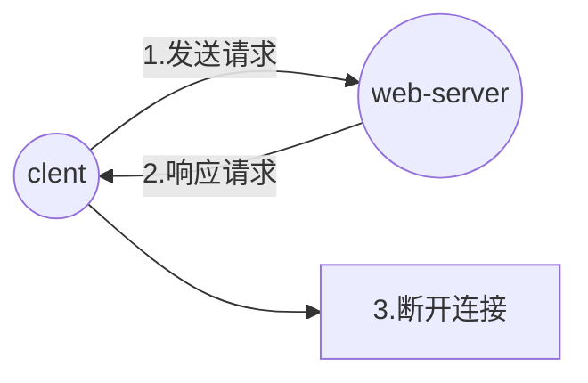

# http

## 一、http工作流程



## 二、http请求格式

### 1.请求行(request line)

#### (1)请求方法

| HTTP标准 | 请求方法  | 说明                                                         |
| -------- | --------- | ------------------------------------------------------------ |
| 1..0     | `GET`     | 请求指定的页面信息,并返回实体主体                            |
| 1.0      | `HEAD`    | 类似于 GET 请求,只不过返回的响应中没有具体的内容,用于获取报头 |
| 1.0      | `POST`    | 向指定资源提交数据进行处理请求(例如提交表单或者上传文件).数据被包含在请求体中。POST 请求可能会导致新的资源的建立和/或已有资源的修改 |
| 1.1      | `put`     | 从客户端向服务器传送的数据取代指定的文档的内容               |
| 1.1      | `DELETE`  | 请求服务器删除指定的页面                                     |
| 1.1      | `CONNECT` | HTTP/1.1 协议中预留给能够将连接改为管道方式的代理服务器      |
| 1.1      | `OPTIONS` | 允许客户端查看服务器的性能                                   |
| 1.1      | `TRACE`   | 回显服务器收到的请求,主要用于测试或诊断                      |
| 1.1      | `PATCH`   | 是对 PUT 方法的补充,用来对已知资源进行局部更新               |

#### (2)请求路径

#### (3)所用协议

| 协议       |
| ---------- |
| `HTTP/1.1` |
| `HTTP/1.0` |
| `HTTP/0.9` |


请求行示例

```http
GET /index.html HTTP/1.1
```

### 2.请求头信息(header)

| 请求头信息        | 说明                                                         |
| ----------------- | ------------------------------------------------------------ |
| `User-Agent`      | client客户端信息                                             |
| `Host`            | 请求的虚拟主机信息                                           |
| `Accept-Language` | 语言                                                         |
| `Content-Length`  | 请求主体长度,告知服务端要接受的主体信息长度                  |
| `Content-Type`    | 请求格式<br/>`POST`时,需要加上`Content-type:application/x-www-form-urlencoded` |
|                   |                                                              |
|                   |                                                              |
|                   |                                                              |
|                   |                                                              |

请求头之后一定会有空行,这是为了区分请求头信息和请求主体信息

### 3.请求主体信息(data)


## 三、http响应格式

### 1.状态行

#### (1)协议版本

| 协议       |
| ---------- |
| `HTTP/1.1` |
| `HTTP/1.0` |
| `HTTP/0.9` |

#### (2)状态码

| 状态码 | 说明 |
| ------ | ---- |
|        |      |
|        |      |
|        |      |
|        |      |


#### (3)状态

```http
HTTP/1.1 200 OK
```

### 2.消息报头

`key: value`格式的响应头部信息

| 响应头信息       | 说明             |
| ---------------- | ---------------- |
| `Server`         | 使用的服务器     |
| `Date`           | 时间             |
| `Content-Type`   | 响应格式         |
| `Content-Length` | 响应大小         |
| `Last-Modified`  | 最后修改时间     |
| `Connection`     | 连接             |
| `ETag`           |                  |
| `Accept-Ranges`  | 响应范围,`bytes` |
| `Content-Length` | 响应主体长度     |
| `Vary`           |                  |
|                  |                  |
|                  |                  |
|                  |                  |
|                  |                  |
|                  |                  |
|                  |                  |
|                  |                  |
|                  |                  |
|                  |                  |

响应头之后一定会有空行,这是为了区分响应头信息和响应主体信息

### 3.响应正文