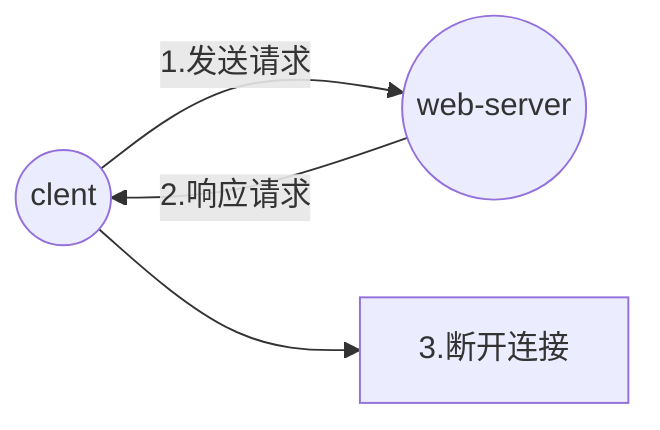

# http

## 一、http工作流程



## 二、http请求格式

### 1.请求行(request line)

#### (1)请求方法

| HTTP标准 | 请求方法  | 说明                                                         |
| -------- | --------- | ------------------------------------------------------------ |
| 1..0     | `GET`     | 请求指定的页面信息,并返回实体主体(页面)<br/>安全性低,数据暴露在url上 |
| 1.0      | `HEAD`    | 类似于 GET 请求,只不过返回的响应中没有具体的内容,用于获取报头 |
| 1.0      | `POST`    | 向指定资源提交数据进行处理请求(例如提交表单或者上传文件)<br/>安全性高,数据被包含在请求体中<br/>POST 请求可能会导致新的资源的建立和/或已有资源的修改<br/>返回数据 |
| 1.1      | `put`     | 从客户端向服务器传送的数据取代指定的文档的内容               |
| 1.1      | `DELETE`  | 请求服务器删除指定的页面                                     |
| 1.1      | `CONNECT` | HTTP/1.1 协议中预留给能够将连接改为管道方式的代理服务器      |
| 1.1      | `OPTIONS` | 允许客户端查看服务器的性能                                   |
| 1.1      | `TRACE`   | 回显服务器收到的请求,主要用于测试或诊断                      |
| 1.1      | `PATCH`   | 是对 PUT 方法的补充,用来对已知资源进行局部更新               |

#### (2)请求路径

#### (3)所用协议

| 协议       |
| ---------- |
| `HTTP/2.0` |
| `HTTP/1.1` |
| `HTTP/1.0` |
| `HTTP/0.9` |


请求行示例

```http
GET /index.html HTTP/1.1
```

`HTTP/2.0`请求行示例

```http
:method: GET
:authority: www.baidu.com
:scheme: https
:path: /index.html
```


### 2.请求头信息(header)

| 请求头信息        | 说明                                                         |
| ----------------- | ------------------------------------------------------------ |
| `User-Agent`      | client客户端信息                                             |
| `Host`            | 请求的虚拟主机信息                                           |
| `Accept`          | 请求允许的数据类型                                           |
| `Accept-Language` | 语言                                                         |
| `referer`         | 请求来源(可以依据这个值反盗链)                               |
| `Content-Length`  | 请求主体长度,告知服务端要接受的主体信息长度                  |
| `Content-Type`    | 请求格式<br/>`POST`时,需要加上`Content-type:application/x-www-form-urlencoded` |
| `Connection`      | 连接状态`keep-alive`、`close`                                |
| `Cache-Control`   | 缓存控制`max-age=0`                                          |
| `Cookie`          | 缓存的信息,用于有状态的交互(保持用户连接)                    |

请求头之后一定会有空行,这是为了区分请求头信息和请求主体信息

### 3.请求主体信息(data)

一般`POST`时会有请求体信息

## 三、http响应格式

### 1.状态行

#### (1)协议版本

| 协议       |
| ---------- |
| `HTTP/1.1` |
| `HTTP/1.0` |
| `HTTP/0.9` |

#### (2)状态码

| 状态码 | 状态文字                   | 说明                                                   |
| ------ | -------------------------- | ------------------------------------------------------ |
| 200    | OK                         | 请求成功,一般用于`GET`与`POST`请求                     |
| 301    | Moved Permanently          | 永久重定向                                             |
| 302    | FOUND                      | 临时重定向                                             |
| 304    | Not Modified               | `ETag`的文件的`Last-Modified`未修改,则重定向到本地缓存 |
| 307    | Temporary Redirect         | 临时重定向,与302类似,但是会把原来的请求数据一同转发    |
| 400    | Bad Request                | 客户端请求的语法错误,服务器无法理解                    |
| 401    | Unauthorized               | 请求要求用户的身份认证                                 |
| 403    | Forbidden                  | 禁止访问                                               |
| 404    | Not Found                  | 请求不存在                                             |
| 405    | Method Not Allowed         | 客户端请求中的方法被禁止                               |
| 408    | Request Time-out           | 服务器等待客户端发送的请求时间过长,超时                |
| 500    | Internal Server Error      | 服务器内部错误,无法完成请求                            |
| 502    | Bad Gateway                | 作为网关或者代理工作的服务器,发现目标不可达            |
| 503    | Service Unavailable        | 由于超载或系统维护,服务器暂时的无法处理客户端的请求    |
| 504    | Gateway Time-out           | 充当网关或代理的服务器,未及时从远端服务器获取请求      |
| 505    | HTTP Version not supported | 服务器不支持请求的HTTP协议的版本                       |
|        |                            |                                                        |


#### (3)状态

```http
HTTP/1.1 200 OK
```

### 2.消息报头

`key: value`格式的响应头部信息

| 响应头信息       | 说明             |
| ---------------- | ---------------- |
| `Server`         | 使用的服务器     |
| `Date`           | 时间             |
| `Content-Type`   | 响应格式         |
| `Content-Length` | 响应大小         |
| `Last-Modified`  | 最后修改时间     |
| `Connection`     | 连接             |
| `ETag`           | 文件标志         |
| `Accept-Ranges`  | 响应范围,`bytes` |
| `Content-Length` | 响应主体长度     |
| `Vary`           |                  |
|                  |                  |
|                  |                  |
|                  |                  |
|                  |                  |
|                  |                  |
|                  |                  |
|                  |                  |
|                  |                  |
|                  |                  |

响应头之后一定会有空行,这是为了区分响应头信息和响应主体信息

### 3.响应正文