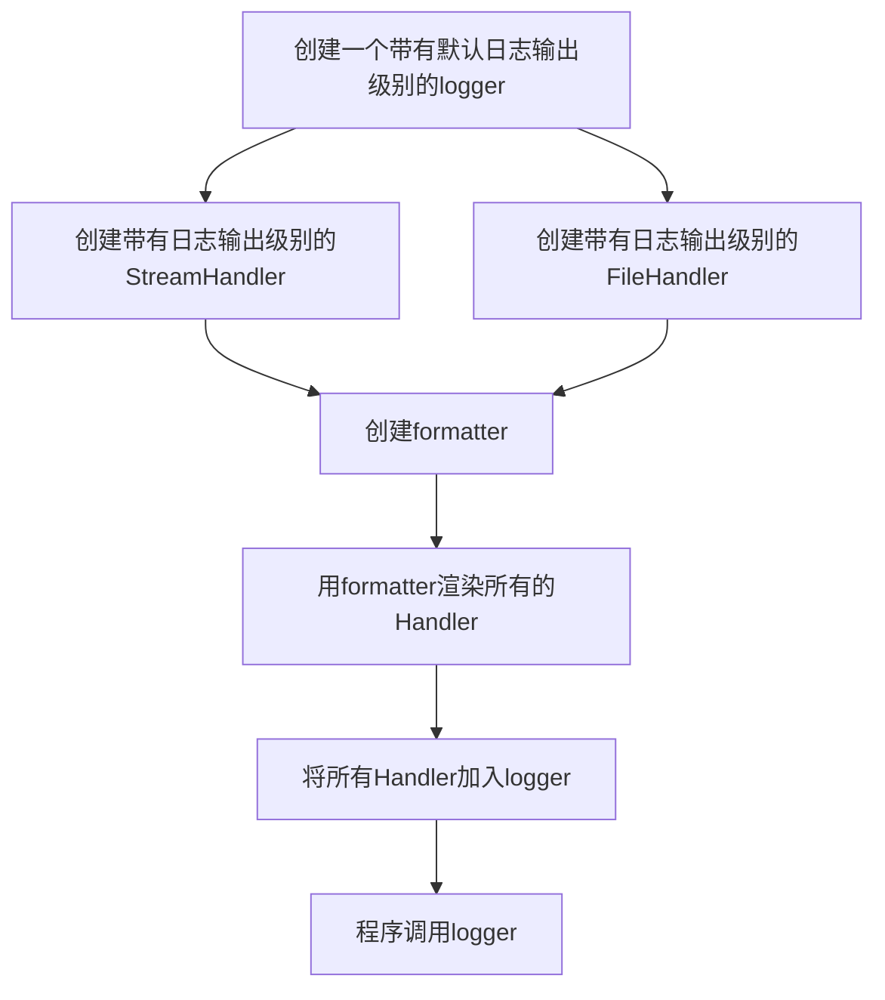

python

## 一、搭建环境

### 1.python3

```shell
sudo apt install python3 python3-pip -y
```

### 2.虚拟环境

#### 第一种方法(推荐第二种)

安装

```shell
sudo apt install virtualenv virtualenvwrapper -y
```

配置

```shell
vim ~/.bashrc
export WORKON_HOME=$HOME/.virtualenvs
source /usr/share/virtualenvwrapper/virtualenvwrapper.sh
```

创建虚拟环境安装模块:

创建命令

```shell
mkvirtualenv -p /usr/bin/python3 python_auto
```

退出虚拟环境

```shell
deactivate
```

删除虚拟环境

```shell
rmvirtualenv python_auto
```

进入虚拟环境

```shell
workon python_auto
```

#### 第二种方法(更好)

安装虚拟环境

```shell
cd dir
python -m venv env_name
```

使用虚拟环境

```shell
.\Scripts\activate.bat
source ./Scripts/activate
```

退出虚拟环境

```shell
.\Scripts\deactivate.bat
```

### 3.pip

安装

```shell
pip install module_name
```

查看模块

```shell
pip list
pip freeze
```

删除模块

```shell
pip uninstall module
```

pip源配置:

临时:

```shell
pip install $package -i $mirror_url
```

永久:

```shell
pip config set global.index-url mirror_url
```

源:

清华：https://pypi.tuna.tsinghua.edu.cn/simple

阿里云：http://mirrors.aliyun.com/pypi/simple/

中国科技大学 https://pypi.mirrors.ustc.edu.cn/simple/

华中理工大学：http://pypi.hustunique.com/

山东理工大学：http://pypi.sdutlinux.org/ 

豆瓣：http://pypi.douban.com/simple/

```shell
pip install xlsxwriter psutil ipy paramiko dnspython pyinstaller pymysql scapy pexpect -i https://pypi.tuna.tsinghua.edu.cn/simple
```

### 4.pycharm连接虚拟环境

ssh联通（root用户）

pycharm建立项目

配置远程解释器

同步代码

## 二、变量

### 保留字

不可以作为变量

| 保留字         | 说明                                                         |
| -------------- | ------------------------------------------------------------ |
| `and`          | 和                                                           |
| `or`           | 或                                                           |
| `is`           | 判断                                                         |
| `not`          | 非                                                           |
| `in`           | 在里面                                                       |
| `False`        | 错误标志                                                     |
| `True`         | 正确标志                                                     |
| `None`         | 空                                                           |
| `if`           | 如果                                                         |
| `elif`         | 如果                                                         |
| `else`         | 如果未匹配表达式                                             |
| `as`           | 重命名                                                       |
| `assert`       | 断言                                                         |
| `class`        | 声明类                                                       |
| `def`          | 声明函数                                                     |
| `global`       | 函数全局声明变量                                             |
| `return`       | 函数返回                                                     |
| `del`          | 删除变量的定义                                               |
| `try`          | 尝试                                                         |
| `except`       | 捕获错误                                                     |
| `finally`      | 无论是否捕获                                                 |
| `while`        | 表达式成立时循环                                             |
| `break`        | 跳出循环                                                     |
| `continue`     | 跳出本次循环                                                 |
| `for`          | 遍历循环                                                     |
| `from`         | 导入模块中的对象(需要声明引用的对象名,`*`可以代表所有,声明后可以直接使用类和函数) |
| `import`       | 导入模块中的对象(不需要声明引用模块的类和函数,但是在使用时需要加上模块名) |
| `lambda`       | 轻量级函数,通常嵌入其他函数中使用                            |
| `nonlocal`     | 重新定义函数外部变量                                         |
| `pass`         | 空代码跳过                                                   |
| `raise`        | 输出错误(如果不带参数就会把当前错误原样抛出)                 |
| `with object ` | 以上下文的方式获取`object`                                   |
| `yield`        | 函数返回生成器对象                                           |


### 标识符

标识变量、函数、类、模块和其他对象的名称

由字母、下划线和数字组成（第一个字符不可为数字）

不可使用保留字

区分字母大小写

下划线开头的具备特殊意义

| 下划线开头                 | 意义             |
| -------------------------- | ---------------- |
| 单下划线开头               | 代表类           |
| 双下划线开头               | 代表类的私有成员 |
| 双下划线开头及双下划线结尾 | python专用标识   |

```python
__file__   # 当前文件
```


### 变量：

必须是有效的标识符

不能使用保留字

慎用小写l和大写O

尽量选择有意义的单词

全局变量，到处都能用，包括函数内部

函数内定义的变量是局部变量，仅函数内生效（除非使用global var  来声明函数内部要定义这一个全局变量）

允许多个变量指向同一个值（内存位置相同）

可以使用id()获取变量的内存

#### 定义变量的方法

| 类型   | 格式                              |
| ------ | --------------------------------- |
| 整形   | 变量名=int                        |
| 字符串 | 变量名="str"                      |
| 列表   | 变量名=["str", int]               |
| 元组   | 变量名=(int,  "str")              |
| 字典   | 变量名={"str": "str", "str": int} |
| 集合   | 变量名=(int, "str")               |

```python
#!/usr/bin/python                # 声明类型,指明解释器命令路径
#!/usr/bin/env python3           # 虚拟环境的解释器的声明
#-*- coding: utf-8 -*-            # 指定字符格式为utf-8（可以打印中文）,python3不用再指定了
```

可以同时多个变量赋值:

```python
a, b, c = 1, 2, 3
```

## 三、注释

`#`可以注释之后的行内信息

```python
print("hello world")   # 打印hello world
```

`'''`到`'''`之间可以注释多行内容

```python
'''
  这是一段无意义内容
  这是一段无意义内容
'''
```

## 四、基本数据类型

### 字符编码格式

| 编码格式  | 说明                                                         |
| --------- | ------------------------------------------------------------ |
| `ASCII`   | 只有127个字符被编码到计算机里，也就是大小写英文字母、数字和一些符号 |
| `GB2312`  | 中文使用                                                     |
| `Unicode` | 所有语言统一,但是所需要存储空间会增大                        |
| `UTF-8`   | 可变长的`Unicode`,节省保存时的存储空间,读到内存时恢复为`Unicode` |

字符编码转换方法

| 方法                  | 说明                                                     |
| --------------------- | -------------------------------------------------------- |
| `str.encode('utf-8')` | 把字符串转化成为utf8的字节表现形式(以`b'str'`的方式显示) |
| `str.decode('utf-8')` | 把字节用uft8解码为字符串                                 |

```shell
print('中文'.encode('utf-8'))
print(b'\xe4\xb8\xad\xe6\x96\x87'.decode('utf-8', errors='ignore')) # 无法解码的部分就用errors='ignore'来跳过
```

数字,字符串,元组是不可变类型 (改变值的话是在内存里开辟新的内存地址存放新值,原内存地址里的值不变)

列表,字典,集合是可变数据类型(内存地址不变的基础上修改值)

### 数字int:

整数int:

十进制: 

```python
universe_age = 14_000_000_000 # 可以使用下划线使数字更易读
print(universe_age)   # 14000000000
```

八进制

```python
print(-0o123) # 0o/0O开头
-83 # 打印出来是十进制
```

十六进制

```python
print (-0x6AF) # 0x/0X开头
-1711 # 打印出来是十进制
```

二进制

```python
print(-0b10) # 0b开头
-2 # 打印出来-2
```

浮点数float

```python
print (-6.16e-2) # e^n代表10^n次方
-0.0616
```

  复数: 实数与虚部相加

### 字符串str:

不可变值数据类型

使用引号连接起来的一段字符

字符串属于序列，属于序列的数据类型都有[下标、遍历循环、切片、拼接]的特性

''和""必须在同一行

'''   '''在不同行

字符串下标:

```python
str1 = "abcde"
for i in str1:
    print(str1[i]) # 遍历输出
```

字符串切片:

`str1[n1:n2:n3]`   第一个数起点是下标(不填默认0)，第二个数是终点但不包括它(不填默认最终)，第三个数是步长不写默认为1（有点像range()）

```python
str1 = "abcde67890"
print(str1[1:3])    # 结果为bc
print(str1[1:-1:2])    # 结果为bd68(-1代表最后一个数但不包括终点0)
print(str1[::-1])    # 结果为09876edcba
```

字符操作:

```python
abc="hello,nice to meet you"
print(len(abc)) # 调用len()函数来算长度
print(abc.__len__()) # 使用字符串的__len__()方法来算字符串的长度
print(abc.capitalize()) # 整个字符串的首字母大写
print(abc.title()) # 每个单词的首字母大写
print(abc.upper()) # 全大写
print(abc.lower()) # 全小写
print("HAHAhehe".swapcase()) # 字符串里大小写互换
print(abc.center(50,"*")) # 一共50个字符,字符串放中间，不够的两边补*
print(abc.ljust(50,"*")) # 一共50个字符,字符串放中间，不够的右边补*
print(abc.rjust(50,"*")) # 一共50个字符,字符串放中间，不够的左边补*
print(" haha\n".strip()) # 删除字符串左边和右边的空格或换行
print(" haha\n".lstrip()) # 删除字符串左边的空格或换行
print(" haha\n".rstrip()) # 删除字符串右边的空格或换行
print(abc.endswith("you")) # 判断字符串是否以you结尾
print(abc.startswith("hello")) # 判断字符串是否以hello开始
print(abc.count("e")) # 统计字符串里e出现了多少次
print(abc.find("nice")) # 找出nice在字符串的第1个下标，找不到会返回-1
print(abc.rfind("e")) # 找出最后一个e字符在字符串的下标，找不到会返回-1
print(abc.index("nice")) # 与find类似，区别是找不到会有异常（报错）
print(abc.rindex("e")) # 与rfind类似，区别是找不到会有异常（报错）
print(abc.isalnum())
print(abc.isalpha())
print(abc.isdecimal())
print(abc.isdigit())
print(abc.islower())
print(abc.isnumeric())
print(abc.isspace())
# 更多 查看函数.字符
```

​    转义字符: 

```python
\续行 \n换行 \0空 \t制表符 \"双引号 \'单引号 \\一个反斜杠 \f换页 \0dd八进制数 \xhh十六进制数
```

### 布尔类型bool: 

True: 1

False: 0

可以进行数值运算

下列几种情况值为假，在if或者while中表现为真

```python
False 或 None
数值中的0、0.0、0+0j
空序列，包括字符串、空元组、空列表、空字典
自定义对象的实例，该对象__bool__方法返回False或者__len__方法返回0
```

### 列表list:

  用中括号表示[1, 2, 3, 4]

  可变值数据类型

  下标是元素的索引

  字符串属于序列，属于序列的数据类型都有[下标、遍历循环、切片、拼接]的特性

  切片按元素分割

```python
print(list1[num1:num2:num3])   #num1起点(默认0),num2终点但不包括,num3偏移量shift默认1
```

  列表可以嵌套


### 元组tuple:

  小括号表示(1,2,3,4)

  相当于只读的列表，不可变（但是元组中的列表可变）

  函数中若有多个返回值,则会返回一段元组

  元组可以赋值给对应个数的对象

### 字典dict:

  花括号表示，存放键值对{"a": 1,"b": 2,"c": 3}

  无序,无下标,不可切片,没有重复的key（但是可以循环遍历）

  可变元数据

### 集合set:

  花括号表示，{1,2,3,4}

  无序,无下标,不可切片,不可重复

  没有value的字典

## 五、数据类型转换

| 函数                   | 作用                                                         |
| ---------------------- | ------------------------------------------------------------ |
| `int(x, base=8)`       | 将x转换成整数类型,默认源数据为10进制,通过`base=n`可以决定转换前的进制数 |
| `float(x)`             | 将X转换成浮点数                                              |
| `str(x)`               | 转为字符串                                                   |
| `list(x)`              | 将x转换为列表                                                |
| `tuple(x)`             | 将xxx转换为元组                                              |
| `dict(x)`              | 将xxx转换为字典                                              |
| `set(xxx)`             | 将xxx转换为集合                                              |
| `complex(real[,imag])` | 创建一个复数                                                 |
| `repr(x)`              | 表达式字符串(解释器可读取的形式\|保留转义字符)               |
| `eval(str)`            | 计算在字符串中的有效python表达式，并返回一个对象。例如：x="8";eval('x+1');>>>9 |
| `chr(x)`               | 将整数x转换为一个字符 例如：97-122 = a-z                     |
| `ord(x)`               | 将一个字符x转换为对应的整数值                                |
| `bin(x)`               | 将整数x转换为一个二进制字符串                                |
| `hex(x)`               | 将整数x转换为一个十六进制字符串                              |
| `oct(x)`               | 将整数x转换为一个八进制字符串                                |
|                        |                                                              |
|                        |                                                              |
|                        |                                                              |
|                        |                                                              |

## 六、基本输入与输出

`input("message")`交互式输入,接受键盘输入的内容(视为字符串)

`print("message")`输出内容

```python
a=10
b=6
print(6)    #6
print(a*b)    #60
print(a if a>b else b)    #10
print(str(a>b))   #True
print("zhongwen")    #zhongwen
fp=open(r'D:\mot.txt','a+')    #打开文件
print("nihao",file=fp)    #输出到文件中
fp.close()    #关闭文件
print("a"+"b")   #ab
print("a","b")   #a b
print("数字为"+str(7))   #数字为7   加号+是拼接需要前后类型都是字符串
print("数字为",7)   #数字为 7    逗号,不是拼接，是分开输出中间有空格
print(a, end=' ')   #,end='分割符' 空格的形况下输出为1行
print('''hello
world''')        #输出为hello\nworld，纯粹的把三个字符中的内容输出
print("hello \
    world")     #输出为hello     world，尽量不使用
print("hello"
    "world")    #输出为helloworld，相当于print("a"+"b")
```

格式化输出:

| 操作符 | 说明             |
| ------ | ---------------- |
| %s     | 字符串           |
| %d     | 整数(向下取整数) |
| %f     | 浮点数(四舍五入) |
| %%     | 输出%            |

保留小数点后两位: 

```python
print("%.2f %d %s %%" % (2.0991478, 2000.977, 234.87))    # 输出2.10 2000 234.87 %
```

格式化输出2:

```python
print("{}{}".format(v1,v2))
```

{}可以写顺序0 - +∞决定使用format()中的具体变量

```python
name = input("input your name:")
age = input("input your age:")
print(name)
print(name+",你2年后"+str(int(age)+2)+"岁了")
print("{},你今年{}岁".format(name,age))
print("{1},你今年{0}岁".format(age,name))
```

  颜色输出:

```python
print("\033[31;1;34m'message'\033[0m")
```

格式化输出3:

```python
print(f"{var}")
```

f-string形式的输出不允许反斜杠


## 七、运算符与表达式

### 算术运算符:

| 算术运算符  | 说明     |
| ----------- | -------- |
| `+`         | 加       |
| `-`         | 减       |
| `*`         | 乘       |
| `/`         | 除       |
| `%`         | 求余     |
| `//`        | 取整除   |
| `**`        | 幂       |
| `abs(int1)` | 求绝对值 |

```python
python=95
english=92
c=89
avg=(python+english+c)/3
print("平均分：" + str(avg) + "分")
```

### 赋值运算符:

| 赋值运算符 | 说明         | 举例    | 展开形式 |
| ---------- | ------------ | ------- | -------- |
| `=`        | 赋值         | `x=y`   | `x=y`    |
| `+=`       | 加赋值       | `x+=y`  | `x=x+y`  |
| `-=`       | 减赋值       | `x-=y`  | `x=x-y`  |
| `*=`       | 乘赋值       | `x*=y`  | `x=x*y`  |
| `/=`       | 除赋值       | `x/=y`  | `x=x/y`  |
| `%=`       | `取余数赋值` | `x%=y`  | `x=x%y`  |
| `**=`      | 幂赋值       | `x**=y` | `x=x**y` |
| `//=`      | 最整除赋值   | `x//=y` | `x=x//y` |

### 比较运算符:

| 比较运算符 | 举例      | 结果                                           |
| ---------- | --------- | ---------------------------------------------- |
| `>`        | `'a'>'b'` | false(字符串是可以进行比较的,根据字符串的位置) |
| `<`        | `'a'>'b'` |                                                |
| `==`       |           |                                                |
| `!=`       | 'y'!='t'  | true                                           |
| `>=`       |           |                                                |
| `<=`       |           |                                                |

### 逻辑运算符:

| 比较运算符 | 说明 |
| ---------- | ---- |
| `and`      | 与   |
| `or`       | 或   |
| `not`      | 非   |

```python
print("面包店打折")
strWeek = input("请输入中文星期")
intTime = int(input("请输入时间中的小时(范围:0-23)："))
if (strWeek == "星期二" and (intTime >= 19 and intTime <= 20)) or (strWeek == "星期六" and (intTime >= 17 and intTime <=18)):
    print("恭喜中奖")
else:
    print ("谢谢惠顾")
```

### 位运算符:

| 位运算符 | 作用         | 说明                                                         |
| -------- | ------------ | ------------------------------------------------------------ |
| `&`      | 按位与       | 对应位都为1才为1                                             |
| `|`      | 按位或       | 对应位都为0才为0                                             |
| `^`      | 按位异或     | 对应位不同为1,相同为0                                        |
| `~`      | 按位取反     | 0为1,1为0                                                    |
| `<<`     | 左移位运算符 | 向左移动一位,最高位舍弃,最低位0填充                          |
| `>>`     | 右移位运算符 | 向右移动一位,最低位舍弃,最高位是0时0填充(保持正数),最高位是1时1填充,相当于/2^n |

```python
print("12&8 = "+str(12&8))   # 12&8 = 8
print("4|8 = "+str(4|8))   # 4|8 = 12
print("31^22 = "+str(31^22))   # 31^22 = 9
print("~123 = "+str(~123))   # ~123 = -124
```

## 八、运算符的优先级

| 类型              | 说明         |
| --------------- | ---------- |
| **              | 幂          |
| ~ + -           | 取反、正号、负号   |
| * / % //        | 算术运算符      |
| + -             | 算术运算符      |
| << >>           | 位运算符中的左移右移 |
| &               | 按位与        |
| ^               | 按位异或       |
| \|              | 按位或        |
| < <= > >= != == | 比较运算符      |

尽可能使用()决定运算顺序

算>比>逻>赋

## 九、条件表达式

```python
if 表达式:
    r=a
elif 表达式:
    r=b
else:
    r=c
#简化
r = a if a > b else b
```

要注意缩进，根据缩进决定嵌套

```python
if flag:        # 表示为真
if not flag:    # 表示为假
```

可以用来判断变量是否输入

```python
qq = input("输入则为输入值，没输入则为3306：")
if not qq:
    qq = 3306
else:
    pass
print(qq) # 没输入的情况下，输出为3306
```

## 十、循环

```python
while 表达式1:
    while 表达式2:
        循环体2
    循环体1
```

| 流程控制   | 说明                           |
| ---------- | ------------------------------ |
| `continue` | 跳出本次循环，进入下一次循环   |
| `break`    | 跳出循环体                     |
| `exit()`   | 退出python程序，可以指定返回值 |

```python
print("除3余二，除5余三，除7于二，这个数为？\n")
none = True
number = 0
while none:
    number += 1
    if number % 3 == 2 and number % 5 == 3 and number % 7 == 2:
        print("此数字为："+str(number))
        none = False
```

```python
for 迭代变量1 in 对象1:
    for 迭代变量2 in 对象2:
        循环体2
    循环体1
```

```python
string = '你好'
print(string)   # 横向显示
for ch in string:   # 遍历字符串
    print(ch)   # 纵向输出
```

```python
for i in range(1,10):
    for j in range(1,i+1):
        print(str(i)+str('*')+str(j)+str("=")+str(i*j)+"\t",end=" ")
    print("")
```

## 十一、函数

一组代码的集合

函数名代表函数本身,如果赋值给某一变量那么,变量本身也可以当作函数使用

```python
print(abs) # <built-in function abs>
f = abs
print(f) # <built-in function abs>
print(f(-10)) # 10
```

函数加上`()`代表调用这个函数

函数有一些固有属性

| 属性       | 说明       |
| ---------- | ---------- |
| `__name__` | 函数的名字 |
|            |            |


### 常用函数:

| 常用函数                                               | 说明                                                         |
| ------------------------------------------------------ | ------------------------------------------------------------ |
| `range(start,end,step)`                                | `start`起始值,省略则为0,`end`终止值,但不包括该值,`step`步长，省略则为1 |
| `len(object)`                                          | 长度                                                         |
| `max(object, key=lambda x:x[1])`                       | 选出最大值                                                   |
| `type(object)`                                         | 判断`object`类型                                             |
| `type('ClassName', (object,), dict(method=func_name))` | 也可以使用`type`创建类,传入类名,继承的元组,方法绑定的函数名  |
| `isinstance(object, (int, float))`                     | 判断类型是否为`int`或`float`,若为`int`或`float`则返回`True`  |
| `enumerate(object, n)`                                 | 枚举，打印`object`的[下标]和[元素\|字符],可以自定义起始[下标]为`n` |
| `eval(str)`                                            | 计算在字符串中的有效python表达式,并返回一个对象,比如字符串为公式时计算结果,json格式时识别为字典 |
| `zip(list1, list2)`                                    | 可以把两个列表按顺序打包到一起,变成一个对象,可以以`list`或`dict`的形式输出 |
| `lambda var: expression`                               | 传入变量`var`返回`expression`的结果,可以嵌入其他函数中使用   |
| `sorted(object, key=lambda x:x[1], reverse=True)`      | 对`object`进行排序,`key`可以是函数名,作用于每个元素后再排序(不修改原值,仅影响排序),`reverse`为`True`时倒序输出(从大到小),不改变原值,`sort()`会改变原值 |
| `iter(object)`                                         | 将`Iterable`转为`Iterator`                                   |
| `map(funcname, Iterable)`                              | 接受函数和`Iterable`,将传入的函数作用于可迭代对象的每个元素,返回新的`Iterator` |
| `filter(funcname, Iterable)`                           | 接受函数和`Iterable`,将传入的函数作用于可迭代对象的每个元素,返回`True`(如果有其它结果那么也会当成`True`)或者`False`,决定是否保留元素 |
| `functools.reduce(funcname, Iterable)`                 | 接受函数(必须接受2个参数)和`Iterable`,将传入的函数作用于前2个可迭代对象的元素后,再把返回的结果和后一个元素进行函数累积计算 |
| `dir(object)`                                          | 获取一个对象的所有属性                                       |
| `hasattr(object, "property")`                          | 判断对象是否有属性`property`,返回`True`和`False`             |
| `getattr(object, "property", 404)`                     | 获取一个属性,不存在则返回自定义的参数                        |
| `setattr(object, "property", "value")`                 | 设置一个属性                                                 |

```python
print(len(abc)) # 调用len()函数来算长度
print(abc.__len__()) # 使用字符串的__len__()方法来算字符串的长度
# 用enumerate()来打印行号
with open("G:/tmp/oui.txt", "r", encoding='utf8') as f:
    for line, text in enumerate(f.readlines(), 1):
        print(line, text)
print(sorted([36, 5, -12, 9, -21], key=abs))
# zip打包列表
a = ['a', 'b', 'c', 'd']
b = ['1', '2', '3', '4']
list(zip(a, b)) # [('a', '1'), ('b', '2'), ('c', '3'), ('d', '4')]
dict(zip(a, b)) # {'a': '1', 'b': '2', 'c': '3', 'd': '4'}
```

合并两个列表的数据

### 判断字符用的函数:

| 函数                      | 作用                                                         |
| ------------------------- | ------------------------------------------------------------ |
| `str0.isnumeric()`        | 检测`str0`是否只由数字组成，数字可以是： Unicode 数字，全角数字（双字节），罗马数字，汉字数字。 |
| `str1.isdigit()`          | 判断`str1`是否为纯数字（浮点数不行）                         |
| `str2.islower()`          | 判断`str2`是否为小写                                         |
| `str3.isupper()`          | 判断`str3`是否为大写                                         |
| `str4.isalnum()`          | 判断`str4`是否为数字字母混合                                 |
| `str5.isalpha()`          | 判断`str5`是否为字母                                         |
| `str6.isspace()`          | 判断`str6`是否全为空格                                       |
| `str7.count(str8)`        | 判断`str7`中`str8`的出现次数                                 |
| `str9.endswith(str10)`    | 判断`str9`是否以`str10`结尾                                  |
| `str11.startswith(str12)` | 判断`str11`是否以`str12`开头                                 |
| `str13.find(str14)`       | 找出`str14`在`str13`中的第1个下标，找不到会返回-1            |
| `str15.rfind(str16)`      | 找出`str16`在`str15`的最后下标，找不到会返回-1               |
| `str17.index(str18)`      | 与find类似,找出`str18`在`str17`中的第1个下标,区别是找不到会有异常（报错） |
| `str19.rindex(str20)`     | 与rfind类似,找出`str20`在`str119`的最后下标区别是找不到会有异常（报错） |
| `str21.isdecimal()`       | 如果`str21`是否只包含十进制字符返回`True`，否则返回`False`   |
|                           |                                                              |
|                           |                                                              |
|                           |                                                              |

```python
print(len(abc)) # 调用len()函数来算长度
print(abc.__len__()) # 使用字符串的__len__()方法来算字符串的长度
```

### 字符操作函数:

| 函数                                      | 作用                                                         |
| ----------------------------------------- | ------------------------------------------------------------ |
| `str0.encode('utf-8')`                    | 编码                                                         |
| `str1.encode('utf-8')`                    | 解码                                                         |
| `str2.capitalize()`                       | 字符串的第一个首字母大写                                     |
| `str3.title()`                            | 每个单词的首字母大写                                         |
| `str4.upper()`                            | 全大写                                                       |
| `str5.lower()`                            | 全小写                                                       |
| `str6.swapcase()`                         | 字符串里大小写互换                                           |
| `str7.center(50, "*")`                    | 一共50个字符,字符串放中间，不够的两边补*                     |
| `str8.ljust(50, "*")`                     | 一共50个字符,字符串放中间，不够的右边补*                     |
| `str9.rjust(50, "*")`                     | 一共50个字符,字符串放中间，不够的左边补*                     |
| `str10.strip()`                           | 删除字符串左边和右边的空格或换行                             |
| `str11.lstrip()`                          | 删除字符串左边空格或换行                                     |
| `str12.rstrip()`                          | 删除字符串右边空格或换行                                     |
| `str13.replace(old_char', 'new_char', 2)` | 从左到右替换字符old为new 最多2次,self可以省略                |
| `str14.split(":", -1)`                    | 将字符串以":"为分隔符输出为列表形式,默认-1全分隔，可以指定次数。 如果参数 num 有指定值，则分隔出 num+1 个子字符串 （分隔num次） |
| `str15.rsplit(":", -1)`                   | 从右往左割                                                   |
| `str16.splitlines()`                      | 行分隔，分割\n和\r                                           |
| `"\|".join([str17, str18, str19])`        | 连接a b c 以\|为分隔符                                       |
| `abs(int1)`                               | 求绝对值                                                     |

### 列表操作函数:

| 类   | 函数                          | 作用                                                         |
| ---- | ----------------------------- | ------------------------------------------------------------ |
| 增   | `list0.append("str1")`        | 在列表`list0`的最后增加一个元素`str1`                        |
|      | `list1.insert(n,"str2")`      | `list1`插入一个元素`str2`,下标为`n`(列表的下标从`0`开始)，原下标为`n`的往后推成为`n+1` |
| 改   | `list2[n] = "str3"`           | 修改`list2`下标为`n`的元素为`str3`                           |
|      | `list3.reverse()`             | 将`list3`的顺序倒装,改变元数据(因为list可变)                 |
| 删   | `list4.remove("str4")`        | 删除`list4`的元素`str4`                                      |
|      | `del list5[n]`                | 删除`list5`元素下标为`n`的元素,无元素下标时,删除整个`list5`  |
|      | `list6.pop(n)`                | 取出`list6`元素下标为`n`的元素，无元素下标时取出`list6`最后一个元素（不打印相当于删除） |
|      | `list7.clear()`               | 清除列表`list7`所有元素,成为空列表,不是删除列表              |
| 查   | `list8.index("str5")`         | 查看`list8`元素`str5`的下标                                  |
|      | `list9.sort()`                | 对列表`list9`进行排序原先是添加顺序,改为按ASCII编码来排序,`reverse=True`可以倒序输出 |
|      | `list10.sorted(reverse=True)` | 将`list10`临时性的排序,不改变元数据,`reverse=True`可以倒序输出 |
|      | `list11.count("str6")`        | 统计`list12`元素`str6`的出现次数                             |
| 连   | `list12.extend(list13)`       | `list12`拼接`list13`                                         |
| 复制 | `list14 = list15[:]`          | 把`list15`的元素赋值给`list14`(采用切片把元素提取出来),如果不切片,两个列表实际会指向同一个列表 |
|      |                               |                                                              |

### 字典操作函数:

| 功能  | 函数                                 | 作用                                                         |
| ----- | ------------------------------------ | ------------------------------------------------------------ |
| 查    | `dict0["key0"]`                      | 查询`dict0`的key="key0"的值,如果key值不存在,会返回keyerror错误 |
|       | `dict1.get("key1", "message1")`      | 查询`dict0`的key="key1"的值,这种取值方法如果key值不存在,会返回`message1`(默认为`none`),不会返回错误 |
|       | `dict2.keys()`                       | 打印`dict2`所有的key,以`dict_keys(['key0', 'key1', 'key2'])`的形式输出 |
|       | `dict3.values()`                     | 打印`dict3`所有的values,以`dict_values(['value0', 'value1', 'value2'])`的形式输出 |
|       | `dict4.items()`                      | 列表套元组`dict_items([('key0', 'value0'), ('key1', 'value1'), ('key2', 'value2')])`，给双变量复制时则一个是key，另一个是key对应的value |
|       | `"key3" in dict5`                    | 查询key0是否存在于dict5中，返回`True`和`False`               |
|       | `list(dict6)`                        | 以list的方式输出key,其实就是dict转list(只保留key)            |
| 增/改 | `dict7 = {}`                         | 创建空字典                                                   |
|       | `dict8["key4"] = "value4"`           | 修改`dict8`中`key4`对应的值,不存在则增加,存在则修改,强制覆盖 |
|       | `dict8.setdefault("key5", "value5")` | 修改`dict9`中`key5`对应的值,有这个`key1`,则不改变,若没有这个key,则增加这个`key=value` ,不强制覆盖 |
|       | `dict9.update(dict10)`               | 将`dict10`更新到`dict9`，`dict9`和`dict10`同时存在的keys会更新成`dict10`的值,`dict10`存在`dict9`不存在,`dict9`增加这个`key=value`,`dict9`存在`dict10`不存在,保持`dict9`的原`key=value` |
| 删    | `dict11.pop("key6")`                 | 取出`dict11`中的`key6`                                       |
|       | `del dict12["key7"]`                 | 删除`dict12`中的`key7`                                       |
|       | `dict13.popitem()`                   | 删除`dict13`显示的最后一条                                   |
|       | `dict14.clear()`                     | 清空字典`dict14`                                             |

### 集合交并补函数:

| 功能         | 函数                              | 作用                                          |
| ------------ | --------------------------------- | --------------------------------------------- |
| 交集         | `set1.isdisjoint(set2)`           | 判断`set1`和`set2`是否存在交集，有交集为False |
|              | `set3.intersection(set4)`         | `set3`和`set4`求交集                          |
|              | `set3 & set4`                     | `set3`和`set4`求交集                          |
| 并集         | `set5.union(set6)`                | `set5`和`set6`求并集                          |
|              | `set5 | set6`                     | `set5`和`set6`求并集                          |
| 补集（差集） | `set7.difference(set8)`           | 求`set7`存在,`set8`不存在的                   |
|              | `set7-set8`                       | 求`set7`存在,`set8`不存在的                   |
| 对称差集     | `set7.symmetric_difference(set8)` | `set7`和`set8`两差集相加                      |
|              | `set7^set8`                       | `set7`和`set8`两差集相加                      |
| 子集         | `set10.issubset(set9)`            | 判断`set10`是否为`set9`子集                   |
|              | `set9.issuperset(set10)`          | 判断`set9`是否包含`set10`                     |

### 集合操作函数:

| 功能 | 函数                      | 作用                                                        |
| ---- | ------------------------- | ----------------------------------------------------------- |
| 创建 | `set1 = set("")`          | 创建空集合                                                  |
| 增加 | `set2.add("str")`         | 增加`set2`集合中的元素"str"                                 |
|      | `set3.update([1, "str"])` | `set3`添加元素,可以添加列表,会按列表的元素转为集合的元素    |
| 删除 | `set4.remove("str")`      | `set4`删除元素`str`,若是删除不存在的元素会报错              |
|      | `set5.discard("str")`     | `set5`删除元素`str`,删除一个不存在的元素不会报错,存在则删除 |

### 自定义函数:

  代码的集合,调用函数时运行代码

  可以传参数(变量),把实参传给形参

  定义函数:

```python
def function_name(a, b, c， d=4):
    code1
    code2
```

​    可以对参数设置默认值，d如果没有传参则默认为4

  使用函数:

```python
function_name(1， 2， 3, 5)
function_name(a=1, b=2, c=3, d=5)
```

​    如果使用了传参，数量要对应

  可变长参数:

```python
def function(*nums):
    sum = 0
    for num in nums:
        sum += num
    print(sum)
```

​    `*args`可以传多个参数，转为列表

```python
def people(name, *args, age=18, **test):
    print(f"\033[31;1;31mTestInfo: {name}\033[0m")
    print(f"\033[31;1;32mTestInfo: {args}\033[0m")
    print(f"\033[31;1;33mTestInfo: {age}\033[0m")
    print(f"\033[31;1;34mTestInfo: {test}\033[0m")
    print(f"\033[31;1;35mTestInfo: {test['salary']}\033[0m")
    print(f'\033[31;1;36mTestInfo: {test["department"]}\033[0m')
people("zhangsan", "man", 25, salary=20000, department="IT")
```

​    `**kwargs`可以接收所有未定义的关键字参数(实参),转为字典

### 函数返回值return:

  运行情况的结果返回

  可以通过`print(function())`打印出返回值

  `return`可以被其他变量调用,相当于函数运行后的结果

  代表函数的结束,`return`之后的代码不运行

  `return`返回元组,可以赋值给对应个数的变量

  `return`可以返回函数(如果是内部自定义函数,每次返回来的函数都不同,即使传入的是相同的参数,因为每次调用函数,都会重新在内部自定义一个新的函数)

`return`可以返回条件表达式,相当于返回它的结果

```python
def lazy_sum(*args):
    def sum():
        ax = 0
        for n in args:
            ax = ax + n
        return ax
    return sum
f = lazy_sum(1, 2, 3, 4, 5) # 虽然已经传参,但是此时因为返回的是变量名,所以赋值的是函数,此时f也是函数名,需要调用才得到结果
print(f) # 返回的是这个函数(没有计算)
print(f()) # 返回计算后的结果

def count():
    fs = []
    for i in range(1, 4):
        def f():
             return i*i # 返回的时i*i,而不是1*1,2*2,3*3
        fs.append(f)
    return fs # 此时i=3了

f1, f2, f3 = count() # 调用函数,f1,f2,f3 = f,且i=3
print(f1(), f2(), f3()) # 返回 9 9 9,因为是先返回函数,都返回完成后才计算,由于变量i是在count这层函数定义的,f这层函数计算时i已经变成最后的3了

def count():
    def f(j):
        def g():
            return j*j # 此时return的j*j不是变量j,而是1*1,2*2,3*3
        return g # 返回函数名g
    fs = []
    for i in range(1, 4):
        fs.append(f(i)) # f(i)立刻被执行，因此i的当前值被传入f(),返回g
    return fs
f1, f2, f3 = count()
print(f1(), f2(), f3()) # 返回1 4 9,因为f(j)是赋值数字给j,对于函数g而言return的是常量,而不是变量
```

### generator函数返回值yield:

  `generator`的函数，在每次调用`next()`的时候执行，遇到`yield`语句返回，再次执行时从上次返回的`yield`语句处继续执行。

  如果使用循环来调用`generator`的函数,那就无法得到`return`的值,除非使用`next()`以及异常捕获`StopIteration`,返回值包含在`StopIteration`的`value`中

```python
def fib(max):
    n, a, b ,sum = 0, 0, 1, 0
    while n <= max:
        yield sum
        sum = a + b
        a = b
        b = sum
        n = n + 1
    return "done"
for i in fib(10):
    print(i)

g = fib(10)
while True:
    try:
        x = next(g)
        print('g:', x)
    except StopIteration as e:
        print('Generator return value:', e.value)
        break
```


### 函数嵌套:

  被嵌套的函数也要先定义才能调用，不能在调用后定义

```python
def max_num2(a, b):
    if a > b:
        return a
    elif b > a:
        return b


def max_num3(n1, n2, n3):
    aaa = max_num2(n1, n2)
    bbb = max_num2(aaa, n3)
    return bbb


print(max_num3(1, 2, 3))
```

### 函数中的变量:

  仅函数内部使用这个变量,除非使用`global`声明这个是一个全局变量

  外部变量可以读取,但不可以修改,除非使用`nolocal`申明要定义的不是一个本地变量

`global`是全局生效,`nolocal`是函数的外一层生效

```python
name = "zhangsan"
def change_name():
    name = "lisi"
    sex = "woman"
    print(name)
change_name()
print(name)
'''
执行结果↓
lisi
zhangsan
'''
```

```python
name = "zhangsan"
def change_name():
    global name, sex
    name = "lisi"
    sex = "woman"
    print(name)
change_name()
print(name, sex)
'''
执行结果↓
lisi
lisi woman
'''
```


### 递归函数:

  自己调用自己

```python
def plus_one(n):
    print(n)
    return plus_one(n+1)


plus_one(0)
```

### 高阶函数:

  把函数名传参给另一个函数

  返回值中包含函数

```python
def higher_function1(a, b, c):
    print(c(a)+c(b))


higher_function1(-3, -5, abs)
higher_function1("hello", "world", len)
higher_function1([1, 2, 3], [4, 5, 6], sum)
'''
结果为↓
-8
10
21
'''
```

## 十二、模块

模块就是定义好了一组函数的代码打包文件

通过`import module_name`，就可以使用模块中已经做好的函数（通过`module_name.function_name()`来使用）

也可以通过 `from module_name import function_name` ,使用模块（调用时可以不写module_name，只写`function_name()`就可以调用模块里的函数）

  `from module_name import *` 可以导入模块里的所有函数

分为:

  标准库: python自带的模块，可以直接调用

  开源模块: 第三方模块,需要pip安装,再调用

  自定义模块: 自己定义的模块（放在sys.path里的可导入路径下即可）

​    安装:`pip install module_name`

`__name__`: 在被引用时是模块名，自己用时是  `__main__` 

### 包:

  相当于模块目录

```python
# __init__.py 包里一定有这个文件，导入包相当于执行这个文件
from . import module_name
from . dir_name import module_name
```

### sys:

| sys函数                           | 作用                                                                 |
| ------------------------------- | ------------------------------------------------------------------ |
| sys.path                        | 模块路径                                                               |
| sys.version                     | python解释器版本                                                        |
| sys.platform                    | 操作系统名称                                                             |
| sys.argv[n]                     | sys.argv[0]等同于shell里的\$0, sys.argv[1]等同于shell里的\$1(脚本里跟着的参数)，以此类推j |
| sys.exit(n)                     | 退出程序,会引出一个异常                                                       |
| sys.stdout.write('hello world') | 不换行打印                                                              |

  sys.path   #模块路径列表

```python
import sys
print(sys.path)
```

### re:

  默认扩展正则

  正则表达式:

| 第一类正则^$.[]*   | 意义                   |
| ------------- | -------------------- |
| .             | 任意单个字符，除了换行符         |
| *             | *之前的一个字符可以出现零次或连续多次  |
| .*            | 这个位置可以匹配任意长度字符       |
| ^             | 行的开头                 |
| $             | 行的末尾                 |
| ^$            | 空行                   |
| []            | 匹配指定字符组内的任意单个字符      |
| [^]           | 匹配不在指定字符组内的任意字符,仅单个  |
| ^[]           | 匹配以指定字符组内任意字符开头，仅单个  |
| ^[^]          | 匹配不以指定字符组内任意字符开头，仅单个 |
| \\<           | 取单词的头（类似^但只要单词的头）    |
| \\>           | 取单词的尾（类似$但只要单词的尾）    |
| \\<\\>        | 精确匹配单词               |
| \\{n\\}       | 匹配前导字符连续n次           |
| \\{n,\\}      | 匹配前导字符至少n次           |
| \\{n,m\\}     | 匹配前导字符n-m次之间         |
| \\(strings\\) | 保存匹配的字符，后面用1，2，3……表示 |
| [0-9]         | 数字0-9一次              |
| [a-z]         | 小写字母一次               |
| [A-Z]         | 大写字母一次               |
| [a-zA-Z]      | 字母一次                 |

| 扩展正则^$.[]*(){}?+\| | 意义                       |
| ------------------ | ------------------------ |
| +                  | 匹配一个或多个前导字符（前导字符的数量不再为1） |
| ?                  | 匹配0个或一个前导字符              |
| \|                 | 匹配a或b                    |
| ()                 | 组字符  (my\|your)self      |
| {}                 | 同正则但不需要\了                |

| 第二类正则需要[] | 意义              |
| --------- | --------------- |
| [:alnum:] | 字母与数字           |
| [:alpha:] | 字母字符（包括大小写字母）   |
| [:blank:] | 空格与制表符          |
| [:digit:] | 数字              |
| [:lower:] | 小写字母            |
| [:upper:] | 大写字母            |
| [:punct:] | 标点符号            |
| [:space:] | 包括换行符，回车在内的所有空白 |

| re模块函数                                           | return                                                       | 功能                                                         |
| ---------------------------------------------------- | ------------------------------------------------------------ | ------------------------------------------------------------ |
| re.compile(pattern)                                  | 包含匹配规则的对象，在此对象下面match、search等方法不需要正则匹配公式 | 建立一个正则表达式对象，然后可以引用这个对象进行匹配字符     |
| re.match(pattern, str)                               | 对象,`.group()`可以返回匹配的字符`.string`可以返回匹配到的整段字符 | 默认开头匹配，类似^，加上.group()可以只显示匹配项（合理使用.*可以匹配任意形式的字符串） |
| re.search(pattern, str)                              | 对象,`.group()`可以返回匹配的字符`.string`可以返回匹配到的整段字符 | 整行匹配，但只匹配第一个（行截取用）加上.group()可以只显示匹配项 |
| re.findall(pattern, str)                             | 对象,`.group()`可以返回匹配的字符`.string`可以返回匹配到的整段字符 | 全匹配并把所有匹配到的字符串做成列表（一般统计次数用）默认只显示匹配项 |
| re.split(pattern, str)                               | 返回list                                                     | 以匹配的字符串做分隔符，并将分割的转为list（列截取）         |
| re.sub("old_char", "new_char", "context", count="n") | 返回字符串                                                   | 匹配并替换,count不指定则为全替换                             |

```python
import re
#re.match()匹配，类似grep，加上.group()可以只显示匹配项
file_tmp = open("e:/tmp/tmp.txt", mode="r", encoding="utf8")
match_list = []
for file_tmp_read in file_tmp.readlines():
    if re.match(".*[0-9]{2,9}", file_tmp_read):
        print(re.match(".*[0-9]{2,9}", file_tmp_read))
        match_list.append(file_tmp_read)
for match_item in match_list:
    print(match_item, end="")
file_tmp.close()
print("---")
#re.search()匹配，类似grep，加上.group()可以只显示匹配项
file_tmp = open("e:/tmp/tmp.txt", mode="r", encoding="utf8")
match_list = []
for file_tmp_read in file_tmp.readlines():
    if re.search("[0-9]{2,9}", file_tmp_read):
        match_list.append(file_tmp_read)
for match_item in match_list:
    print(match_item, end="")
file_tmp.close()
print("---")
# re.findall()匹配，类似grep
file_tmp = open("e:/tmp/tmp.txt", mode="r", encoding="utf8")
match_list = []
for file_tmp_read in file_tmp.readlines():
    if re.findall("[0-9]{2,9}", file_tmp_read):
        print(re.findall("[0-9]{2,9}", file_tmp_read))
        match_list.append(file_tmp_read)
for match_item in match_list:
    print(match_item, end="")
file_tmp.close()
print("---")
#re.split()分隔
print(re.split(":", "root:x:0:0:/bin/bash:/home/root"))
print("---")
#re.sub()替换
print(re.sub(":", "-", "root:x:0:0:/bin/bash:/home/root"))
print("---")
```

### os:

|              | os函数                                                       | 作用                                                         |
| ------------ | ------------------------------------------------------------ | ------------------------------------------------------------ |
| 查           | `os.getcwd()`                                                | 打印当前目录（pwd）                                          |
|              | `os.chdir("/dir")`                                           | 改变当前目录                                                 |
|              | `os.curdir`                                                  | 打印当前目录（.）                                            |
|              | `os.pardir`                                                  | 打印上级目录（..）                                           |
|              | `os.listdir("/dir")`                                         | 返回列表形式的目录内容                                       |
|              | `os.scandir(“/dir”)`                                         | 返回目录，需要遍历打印出来                                   |
|              | `os.walk("/dir")`                                            | 遍历目录树，返回(dirpath路径, dirnames目录中的文件夹列表, filenames目录中的文件列表) |
|              | `os.stat("/dir/file")`                                       | 查看文件的状态（类key: value的元组），可以用下标来元素切片，也可以通过.key_name获取所需值 |
|              | `os.access("file", os.R_OK)`                                 | 权限判断(F_OK判断路径是否存在、R读、W写、X执行)              |
|              | `os.path.getsize("/dir/file")`                               | 获取文件的大小                                               |
|              | `os.path.abspath("file")`                                    | 获取文件的绝对路径                                           |
|              | `os.path.dirname("/dir/file")`                               | 获取文件的绝对路径目录                                       |
|              | `os.path.basename("/dir/file")`                              | 获取文件的名称                                               |
|              | `os.path.split("/dir/file")`                                 | 把dirname和basename分开，结果以tuple类型输出                 |
|              | `os.path.splitext("/dir/file")`                              | 分割文件和拓展名                                             |
|              | `os.path.join("/dir", "file")`                               | 把dirname和basename合并                                      |
|              | `os.path.isfile("/dir/file")`                                | 判断是否为文件                                               |
|              | `os.path.isabs("/dir/file")`                                 | 判断是否为绝对路径                                           |
|              | `os.path.exists("dir/file")`                                 | 判断路径文件，存在为True                                     |
|              | `os.path.isdir("dir/file")`                                  | 判断是否为目录                                               |
|              | `os.path.islink("dir/file")`                                 | 判断是否为链接文件                                           |
|              | `os.readlink("bin")`                                         | 显示实际路径名                                               |
|              | `os.environ`                                                 | 返回返回json格式的环境变量，与字典相同，也可以通过os.environ["key"]="value",来设置变量，但退出终端后失效 |
|              | `os.getpid()`                                                | 返回当前进程的进程id`pid`                                    |
|              | `os.getppid()`                                               | 返回当前进程的父进程id`ppid`                                 |
| 改           | `os.rename("/dir/file1", "/dir/file2")`                      | 改名                                                         |
|              | `os.chown("/dir/file", uid, gid, *, dir_fd=None, follow_symlinks=True)` | 修改权限所属                                                 |
|              | `os.chroot("path")`                                          | 修改进程的根目录                                             |
|              | `os.remove("/dir/file")`                                     | 删除                                                         |
|              | `os.mkdir("/dir")`                                           | 创建目录                                                     |
|              | `os.rmdir("/dir")`                                           | 删除目录                                                     |
|              | `os.makedirs("/dir1/dir2/dir3")`                             | 递归创建目录                                                 |
|              | `os.removedirs("/dir1/dir2/dir3")`                           | 递归删除目录                                                 |
|              | `os.link("old", "new")`                                      | 创建硬链接                                                   |
|              | `os.symlink("old", "new")`                                   | 创建软链接                                                   |
|              | `os.unlink("/bin")`                                          | 删除软链接                                                   |
| 执行系统命令 | `os.popen("bash_command")`                                   | 调用shell命令，不输出命令返回的结果，需要得到命令的结果则需要加上.read()来获取 |
|              | `os.system("bash_command")`                                  | 调用shell命令，一定会返回命令的结果，但print()的结果是命令运行后的返回值return,相当于运行`bash script.sh`会创建一个子进程在系统上执行命令行，子进程的执行结果无法影响主进程 |
| 系统调用     | `os.fork()`                                                  | 当前为当前程序创造一个子进程,返回2次,在子进程返回0,在父进程中返回子进程的pid(Windows下不能使用) |
|              |                                                              |                                                              |

```python
print('Process (%s) start...' % os.getpid())
# Only works on Unix/Linux/Mac:
pid = os.fork() # 一次函数调用返回2次函数,一个是0返回给子进程,一个是子进程id返回给父进程
if pid == 0:
    print('I am child process (%s) and my parent is %s.' % (os.getpid(), os.getppid()))
else:
    print('I (%s) just created a child process (%s).' % (os.getpid(), pid))
```

### multiprocessing:

|          | 函数                                                         | 功能                                                         |
| -------- | ------------------------------------------------------------ | ------------------------------------------------------------ |
| 查       | `multiprocessing.cpu_count()`                                | cpu个数                                                      |
|          | `multiprocessing.set_start_method('spawn')`                  | 设置启动方式`spawn`为Windows 和 macOS 默认启动方式,`fork`只存在于`unix`,`forkserver`支持通过Unix管道传递文件描述符 |
| 单子进程 | `multiprocessing.Process(target=func_name, args=('arg', ))`  | 创建一个要运行的子进程对象                                   |
|          | `process_object.start()`                                     | 启动一个要运行的子进程对象                                   |
|          | `process_object.join()`                                      | 等待,完成了要运行的子进程对象,再往下执行代码                 |
| 多子进程 | `multiprocessing.Pool(n)`                                    | 创建容纳n个子进程的进程池,无参数默认使用CPU个数              |
|          | `processpool_object.apply_async(func_name, args=("", ))`     | 在进程池对象中创建并运行子进程,如果进程池已满,将会等待进程池释放进程后再加入进程池 |
|          | `processpool_object.close()`                                 | 停止向进程池添加进程                                         |
|          | `processpool_object.join()`                                  | 等待,完成了所有要运行的子进程对象后,再往下执行代码           |
|          | `multiprocessing.Manager()`                                  | 这个对象可以用于在不同进程中共享数据                         |
|          | `multiprocessing.managers.BaseManager(address=('', 5000), authkey=b'passwd')` | 创建一个多进程管理器                                         |

```python
from multiprocessing import Process
import os
import time

def run_proc(name):
    print('Run child process %s (%s)...' % (name, os.getpid()))
    print(time.strftime("%Y-%m-%d %H:%M:%S",time.localtime()))
    time.sleep(1)
    print(time.strftime("%Y-%m-%d %H:%M:%S",time.localtime()))

if __name__=='__main__':
    print('Parent process %s.' % os.getpid())
    p = Process(target=run_proc, args=('test',))
    print('Child process will start.')
    p.start()
    p.join()
    print('Child process end.')
```

```python
from multiprocessing import Pool 
import logging
Formatter = "%(asctime)s [%(levelname)s] %(filename)s:%(lineno)s %(message)s"
logging.basicConfig(datefmt='%Y/%m/%d %H:%M:%S', format=Formatter, level=logging.DEBUG)
def long_time_task(name):
    logging.debug('Run task %s (%s)...' % (name, os.getpid()))
    start = time.time()
    time.sleep(random.random() * 3)
    end = time.time()
    logging.debug('Task %s runs %0.2f seconds.' % (name, (end - start)))

if __name__=='__main__':
    logging.debug('Parent process %s.' % os.getpid())
    p = Pool(4)
    for i in range(5):
        p.apply_async(long_time_task, args=(i,))
    logging.debug('Waiting for all subprocesses done...')
    p.close()
    p.join()
    logging.debug('All subprocesses done.')
```

### threading:

|          | 函数                                                         | 功能                                                         |
| -------- | ------------------------------------------------------------ | ------------------------------------------------------------ |
| 单线程   | `threading.Thread(target=func_name, name='threading_name', args=("str", ))` | 创建一个线程                                                 |
|          | `threading.current_thread()`                                 | 当前线程的实例,具有`name`等属性                              |
|          | `thread_object.start()`                                      | 启动线程                                                     |
|          | `thread_object.join()`                                       | 等待,完成了要运行的线程对象,再往下执行代码                   |
| 锁       | `threading.Lock()`                                           | 创建一个锁对象                                               |
|          | `lock_object.acquire()`                                      | 让当前线程获取锁                                             |
|          | `lock_object.release()`                                      | 让当前线程释放锁                                             |
| 线程变量 | `threading.local()`                                          | 创建一个线程变量对象,每个线程`thread_object`都可以对他进行读写属性,线程之间赋值的属性互不干扰 |
|          | `threading.active_count()`                                   | 当前活跃线程数                                               |

```python
import threading
    
# 创建全局ThreadLocal对象:
local_school = threading.local()

def process_student():
    # 获取当前线程关联的student:
    std = local_school.student
    print('Hello, %s (in %s)' % (std, threading.current_thread().name))

def process_thread(name):
    # 绑定ThreadLocal的student:
    local_school.student = name
    process_student()

t1 = threading.Thread(target= process_thread, args=('Alice',), name='Thread-A')
t2 = threading.Thread(target= process_thread, args=('Bob',), name='Thread-B')
t1.start()
t2.start()
t1.join()
t2.join()
```

### queue:

| 函数                     | 说明                                       |
| ------------------------ | ------------------------------------------ |
| `queue.Queue()`          | 创建一个queue对象                          |
| `queue_object.put(item)` | 添加元素(队列满的时候会卡住等待空闲时添加) |
| `queue_object.get()`     | 获取元素(没获取到时会卡住等待直到获取成功) |


### subprocess:

subprocess使用shell=True,来确定输入的命令为字符串形式,否则要以列表的形式输入每一个参数

| 类型 | 函数                              | 功能                                                         |
| ---- | --------------------------------- | ------------------------------------------------------------ |
| 管道 | `subprocess.PIPE`                 | 可被 stdin, stdout 或者 stderr 参数使用的特殊值, 表示打开标准流的管道. |
| 执行 | `subprocess.call("bash_command")` | 同`os.system("bash_command")`                                |
|      |                                   |                                                              |
|      |                                   |                                                              |
|      |                                   |                                                              |
|      |                                   |                                                              |
|      |                                   |                                                              |


### time|datetime|calendar:

| 时间类型                  | 描述                            |
| --------------------- | ----------------------------- |
| struct_time(时间元组)     | 记录时间的年,月,日,时,分等               |
| timestamp时间戳（epoch时间） | 记录离1970-01-01 00:00:00有多少秒    |
| 格式化的时间字符串             | 如2018-01-01 12:00:00(格式可以自定义) |

| time函数                                              | 作用                                                        |
| ----------------------------------------------------- | ----------------------------------------------------------- |
| `time.sleep(1)`                                       | 等待时间1秒                                                 |
| `time.time()`                                         | 返回时间戳                                                  |
| `time.localtime()`                                    | 返回时间元组(当前时区)                                      |
| `time.mktime(time.localtime())`                       | 时间元组转时间戳                                            |
| `time.strftime("%Y-%m-%d %H:%M:%S",time.localtime())` | 时间元组转格式化字符串 (可自定义)，默认当前时间             |
| `time.asctime(time.localtime())`                      | 时间元组转格式化字符串(常规格式)                            |
| `time.localtime(86400)`                               | 打印离1970年86400秒的时间，本地时区(时间戳转时间元组)       |
| `time.gmtime(86400)`                                  | 打印离1970年86400秒的时间，格林威治时间（时间戳转时间元组） |
| `time.ctime(335235)`                                  | 时间戳转格式化字符串                                        |

| datetime\|calendar函数                                       | 作用                                                         |
| ------------------------------------------------------------ | ------------------------------------------------------------ |
| `datetime.datetime(year, month, day, hour, minute, second, microsecond, tzinfo)` | 创建一个时间对象年月日必要                                   |
| `datetime.datetime.now()`                                    | 当前时间                                                     |
| `datetime.datetime.utcnow()`                                 | 显示UTC时间,`.replace(*tzinfo*=datetime.timezone.utc)`显示时间的基础上显示时区 |
| `datetime_object.astimezone(datetime.timezone(datetime.timedelta(hours=8)))` | 显示对应时区的时间                                           |
| `datetime.datetime.now()+datetime.timedelta(+3)`             | 3天后                                                        |
| `datetime.datetime.now()+datetime.timedelta(days=-3)`        | 3天前                                                        |
| `datetime.datetime.now()+datetime.timedelta(hours=5)`        | 5小时后                                                      |
| `datetime.datetime.now()+datetime.timedelta(minutes=-10)`    | 10分钟前                                                     |
| `datetime.datetime.now()+datetime.timedelta(weeks=1)`        | 1周后                                                        |
| `datetime.datetime.fromtimestamp()`                          | 格式化一个时间戳                                             |
| `datetime.timezone(datetime.timedelta(hours=8))`             | 创建一个时区对象                                             |
| `calendar.calendar(2018)`                                    | 2018日历                                                     |
| `calendar.isleap(1800)`                                      | 判断闰年                                                     |

```python
import time
import datetime
import calendar
# 打印时间
print(time.gmtime())        #+00：00
print(time.localtime())        #+08：00本地时区
print("---打印时间，格式化输出1---")
print(f"{time.localtime().tm_year}-"
      f"{time.localtime().tm_mon}-"
      f"{time.localtime().tm_mday} "
      f"{time.localtime().tm_hour}:"
      f"{time.localtime().tm_min}:"
      f"{time.localtime().tm_sec}")
print("---打印时间，格式化输出2---")
print(time.strftime("%Y-%m-%d %H:%M:%S"))
print("---打印时间，格式化输出3---")
print(time.strftime("%F %T")) 
print("---打印时间，格式化输出4---")
print(datetime.datetime.now())
print(datetime.datetime.now()+datetime.timedelta(+3)) # 三天后
print(datetime.datetime.now()+datetime.timedelta(days=-3)) # 三天前
print(datetime.datetime.now()+datetime.timedelta(hours=5)) # 五小时后
print(datetime.datetime.now()+datetime.timedelta(minutes=-10)) # 十分钟前
print(datetime.datetime.now()+datetime.timedelta(weeks=1)) # 一星期后
print("---打印日历---")
print(calendar.calendar(2018))
print("---判断闰年---")
print(calendar.isleap(1800))
```

```python
import datetime
birthday = datetime.date.today().replace(1995, 2, 28)
print("{}是你出生10000天纪念日".format(birthday+datetime.timedelta(days=10000)))
```

### random:

| random函数                        | 作用                       |
| ------------------------------- | ------------------------ |
| random.random()                 | 0-1之间的浮点数随机              |
| random.uniform(1,3)             | 1,3之间的浮点数随机              |
| random.randint(1,3)             | 1,3之间随机整数                |
| random.randrange(1,60,2)        | 1,60-1之间的随机以2为步长的整数      |
| random.choice("hello world")    | 字符串or列表or元组里随机一位，包含中间的空格 |
| random.sample("hello world", 3) | 字符串里随机3位，包含中间的空格,做成list  |
| random.shuffle(list)            | 将列表洗牌，打乱顺序               |
|                                 |                          |
|                                 |                          |

```
import random
num = random.randint(1,100)
```

### getpass:

  隐藏式输入

```python
import getpass
username=input("username:")
password=getpass.getpass("password:")
if username == "daniel" and password == "123":
    print("login success")
else:
    print("login failed")
```

### json:

| json函数                                                     | 作用                                                         |
| ------------------------------------------------------------ | ------------------------------------------------------------ |
| `json.dump("data", open(file, "w"), default=None, ensure_ascii=False)` | 序列化一组数据为 `JSON `形式的` file-like object`,`ensure_ascii=False`可以保留字符串原始编码,不转换为`ASCII` |
| `json.dumps("data", default=None)`                           | 序列化一组数据为 `JSON `形式的`str`,`default`为自定义转换方法 |
| `json.load(file open(file, "r"))`                            | 从文件读取一组数据                                           |
| `json.loads(str)`                                            | 读取一组数据                                                 |

```python
import json
numbers = [2, 3, 4, 5, 6, 7]
filename = "numbers.json"
def object2dict(std):
    return {
        'name': std.name,
        'age': std.age,
        'score': std.score
    }
# 通常class的实例都有一个__dict__属性，它就是一个dict，用来存储实例变量。也有少数例外，比如定义了__slots__的class所以也可以是return obj.__dict__的函数
with open(filename, "w") as f:
    json.dump(numbers, f, default=object2dict)
    # json.dumps(s, default=student2dict)
```

```python
import json
numbers = [2, 3, 4, 5, 6, 7]
filename = "numbers.json"
def dict2object(std):
    return {
        'name': std.name,
        'age': std.age,
        'score': std.score
    }
with open(filename, "r") as f:
    json.load(f)
```

### unittest:

测试函数:

```python
import unittest
from function import module  #引入待测试的模块.函数
'''自定义一个测试继承unittest中的TestCase'''
class ATestCase(unittest.TestCase):
    def test_function(self):
        '''具体的测试步骤'''
        '''被测试的函数的值赋值给testfunction'''
        testfunction = function('', '')
        '''用断言方法测试是否通过，assertEqual是断言方式之一'''
        self.assertEqual(testfunction, '正确的结果')
'''此模块自己用才能用， __name__是模块名，自己用时是__main__,被引用时是模块名'''
if __name__ == "__main__":
    unittest.main()
```

断言方法:

| 方法                      | 用途            |
| ----------------------- | ------------- |
| assertEqual(a, b)       | 核实a == b      |
| assertNotEqual(a, b)    | 核实a != b      |
| assertTrue(x)           | 核实 x ==True   |
| assertFalse(x)          | 核实x ==False   |
| assertIn(item, list)    | 核实item在list中  |
| assertNotIn(item, list) | 核实item不在list中 |

测试类:

```python
class AnonymousSurvey:
    """定义一个类"""
    def __init__(self, question):
        """键入问题与空列表"""
        self.question = question
        self.responses = []
    def show_question(self):
        """定义一个打印问题的方法"""
        print(self.question)
    def store_response(self, new_response):
        """定义一个存储问题的方法，list.append()"""
        self.responses.append(new_response)
    def show_results(self):
        """定义一个打印结果的方法"""
        print("Survey results:")
        for response in self.responses:
            print(f"- {response}")
```

```python
import unittest
from survey import AnonymousSurvey
class TestAnonymousSurvey(unittest.TestCase):
    """定义一个测试环节"""
    def setUp(self):
        """
        setUp()会是类中最先运行的，所以可以用它来创建测试用到的属性，供方法调用它们
        """
        question = "What language did you first learn to speak?"
        self.my_survey = AnonymousSurvey(question)
        self.responses = ['English', 'Spanish', 'Mandarin']
    def test_store_single_response(self):
        """Test that a single response is stored properly."""
        self.my_survey.store_response(self.responses[0])
        self.assertIn(self.responses[0], self.my_survey.responses)
    def test_store_three_responses(self):
        """Test that three individual responses are stored properly."""
        for response in self.responses:
            self.my_survey.store_response(response)
        for response in self.responses:
            self.assertIn(response, self.my_survey.responses)
if __name__ == '__main__':
    unittest.main()
```

### difflib:

| diff符号 | 作用     |
| ------ | ------ |
| '-'    | 第一序列少的 |
| '+'    | 第二序列多的 |
| ''     | 一致     |
| '?'    | 增量差异   |
| '^'    | 差异字符   |

| difflib函数                            | 功能                        |
| ------------------------------------ | ------------------------- |
| difflib.Differ().compare(str1, str2) | 对比str1和str2(需要前面join后输出)  |
| HtmlDiff().make_file(str1, str2)     | 对比str1和str2,html可视化       |
| HtmlDiff().make_table(str1, str2)    | 对比str1和str2,html可视化(简单模式) |
|                                      |                           |
|                                      |                           |

difflib.Differ().compare(str1, str2)

```python
import difflib
with open("/home/lxw/vscode_pyfile/machineInfo.py", "r", encoding="utf8") as f1:
    f1lines = f1.read().splitlines(True)
with open("/home/lxw/vscode_pyfile/windowsmachineinfo.py", "r", encoding="utf8") as f2:
    f2lines = f2.read().splitlines(True)
result_message = "\n".join(difflib.Differ().compare(f1lines, f2lines))
print("对比结果:\n", result_message)
```

HtmlDiff().makefile(str1, str2)

```python
import difflib
with open("/home/lxw/vscode_pyfile/machineInfo.py", "r", encoding="utf8") as f1:
    f1lines = f1.read().splitlines(True)
with open("/home/lxw/vscode_pyfile/windowsmachineinfo.py", "r", encoding="utf8") as f2:
    f2lines = f2.read().splitlines(True)
result_message = difflib.HtmlDiff().make_file(f2lines, f1lines)
with open("/home/lxw/vscode_pyfile/diff.html", "w", encoding="utf8") as f3:
    f3.write(result_message)
```

通过输入，完成diff

```python
import difflib
import sys
with open(sys.argv[1], "r", encoding="utf8") as f1:
    f1lines = f1.read().splitlines(True)
with open(sys.argv[2], "r", encoding="utf8") as f2:
    f2lines = f2.read().splitlines(True)
result_message = difflib.HtmlDiff().make_file(f2lines, f1lines)
with open(sys.argv[3], "w", encoding="utf8") as f3:
    f3.write(result_message)
```

```python
import difflib
file1 = input("对比文件1路径: ")
file2 = input("对比文件2路径: ")
file3 = input("生成diff.html路径: ")
with open(file1, "r", encoding="utf8") as f1:
    f1lines = f1.read().splitlines(True)
with open(file2, "r", encoding="utf8") as f2:
    f2lines = f2.read().splitlines(True)
result_message = difflib.HtmlDiff().make_file(f2lines, f1lines)
with open(file3, "w", encoding="utf8") as f3:
    f3.write(result_message)
```

### filecmp:

| 功能   | 函数                                                                | 作用                                                                  |
| ---- | ----------------------------------------------------------------- | ------------------------------------------------------------------- |
| 文件比对 | filecmp.cmp(file1, file2, shallow=True)                           | 单文件信息对比,shallow默认为True，只对比stat，不对比文件内容差异,False会对比文件内容,相同返回True      |
|      | filecmp.cmpfiles(dir1, dir2, [files_list])                        | 多文件信息对比,返回\[匹配的]\[内容不匹配的]\[独有的]                                     |
| 目录比对 | filecmp.dircmp(dir1, dir2, ignore, hide)                          | 目录文件对比,默认ignore=['RCS', 'CVS', 'tags'], hide=[os.curdir, os.pardir] |
|      | filecmp.dircmp(dir1, dir2, ignore, hide).report()                 | 输出当前目录比对的结果，详细                                                      |
|      | filecmp.dircmp(dir1, dir2, ignore, hide).report_partial_closure() | 当前目录及下一级子目录                                                         |
|      | filecmp.dircmp(dir1, dir2, ignore, hide).report_full_closure()    | 所有目录结构                                                              |
|      | filecmp.dircmp(dir1, dir2, ignore, hide).left                     | 左目录，right右目录                                                        |
|      | filecmp.dircmp(dir1, dir2, ignore, hide).left_list                | 左目录文件夹列表输出其中的文件，right_list右目录                                       |
|      | filecmp.dircmp(dir1, dir2, ignore, hide).common                   | 左右共同存在的内容，不检验文件内容                                                   |
|      | filecmp.dircmp(dir1, dir2, ignore, hide).left_only                | 左边独有的, right_only右边独有的                                              |
|      | filecmp.dircmp(dir1, dir2, ignore, hide).common_dirs              | 两边目录都存在的子目录                                                         |
|      | filecmp.dircmp(dir1, dir2, ignore, hide).common_files             | 两边目录都存在的子文件                                                         |
|      | filecmp.dircmp(dir1, dir2, ignore, hide).same_files               | 左右共同存在的内容,检查文件的内容                                                   |
|      | filecmp.dircmp(dir1, dir2, ignore, hide).diff_files               | 左右共同存在, 但内容不匹配的                                                     |
|      | filecmp.dircmp(dir1, dir2, ignore, hide).funny_files              | 两边目录中都存在,但无法比较的文件                                                   |
|      | filecmp.dircmp(dir1, dir2, ignore, hide).subdirs                  | 将 common_dirs 目录名映射到新的 dircmp 对象，格式为字典类型                            |

```python
import filecmp
print(filecmp.dircmp("/code", "/data").report())
print(filecmp.dircmp("/code", "/data").report_partial_closure())
print(filecmp.dircmp("/code", "/data").report_full_closure())
print(filecmp.dircmp("/code", "/data").common)
print(filecmp.dircmp("/code", "/data").left)
print(filecmp.dircmp("/code", "/data").left_list)
print(filecmp.dircmp("/code", "/data").left_only)
print(filecmp.dircmp("/code", "/data").common_dirs)
print(filecmp.dircmp("/code", "/data").common_files)
print(filecmp.dircmp("/code", "/data").same_files)
print(filecmp.dircmp("/code", "/data").diff_files)
```

### smtplib:

| 函数                                                                                                                            | 功能                    |
| ----------------------------------------------------------------------------------------------------------------------------- | --------------------- |
| smtplib.SMTP(host='SMTP-SERVER', port=25, local_hostname=None, timeout=socket.\_GLOBAL\_DEFAULT_TIMEOUT, source_address=None) | 创建SMTP客户端一般填host和port |
| smtplib.SMTP.connect(host='', port=25)                                                                                        | 连接方法                  |
| smtplib.SMTP.login(user, password)                                                                                            | 校验方法                  |
| smtplib.SMTP.sendmail(from_addr, to_addrs, msg, mail_options, rcpt_options)                                                   | 邮件发送功能，前三个必填          |
| smtplib.SMTP.starttls(keyfile, certfile)                                                                                      | 启用TLS加密传输             |
| smtplib.SMTP.quit()                                                                                                           | 断开连接                  |

```python
import smtplib
user_mail = ""
to_user_mail = ""
subject = "python test mail"
text = "This is a test mail."
body = "\n".join([
    "From: {}".format(user_mail),
    "To: {}".format(to_user_mail),
    "Subject: {}".format(subject),
    "",
    text
])
smtp_server = smtplib.SMTP(host='smtp.qq.com', port=587)
smtp_server.connect(host='smtp.qq.com', port=587)
smtp_server.starttls()
smtp_server.login(user=user_mail, password="")
smtp_server.sendmail(from_addr=user_mail, to_addrs=to_user_mail, msg=body)
smtp_server.quit()
```

### shutil:

| 函数 | 功能 |
| ---- | ---- |
|      |      |
|      |      |
|      |      |

### functools:

| -    | 函数                                           | 功能                                                         |
| ---- | ---------------------------------------------- | ------------------------------------------------------------ |
|      | `functools.wraps()`                            | 需要把原始函数的`__name__`等属性复制到新函数中               |
|      | `functools.reduce(funcname, Iterable)`         | 将返回结果视为一个`Iterable`中的元素                         |
|      | `functools.partial(funcname, keyname="value")` | 在已有函数基础上,为某些参数设置默认值,返回一个新的函数,新参数依然可以传新参数 |
|      |                                                |                                                              |

```python
import functools
int2 = functools.partial(int, base=2)
print(int2("100000"))
print(int2("100000", base=10))
```

### enum:

| 类             | 功能                                                         |
| -------------- | ------------------------------------------------------------ |
| `enum.Enum`    | 通过类继承使用将属性以字典{'property_name': <ClassName.property_name: 'value'>}的方式添加到`__members__` |
| `@enum.unique` | 确保枚举唯一值                                               |

```python
print(Enum.__members__)
@enum.unique
class Month(Enum):
    Jan = 1
    Feb = 2
    Mar = 3
    Apr = 4
    May = 5
    Jun = 6
    Jul = 7
    Aug = 8
    Sep = 9
    Oct = 10
    Nov = 11
    Dec = 12

print(Month.__members__)
for name, member in Month.__members__.items():
    print(name, '=>', member, ',', member.value)
```

### logging:

`logging`是多线程的可能会比`print()`先执行

| 日志级别   | 数值 |
| ---------- | ---- |
| `CRITICAL` | 50   |
| `ERROR`    | 40   |
| `WARNING`  | 30   |
| `INFO`     | 20   |
| `DEBUG`    | 10   |
| `NOTSET`   | 0    |

默认级别是`WARNING`,通过`logging.basicConfig()`可以修改

|             | 函数                                                         | 功能                                                         |
| ----------- | ------------------------------------------------------------ | ------------------------------------------------------------ |
|             | `logging.debug("%s %s", var1, var2)`                         | 输出不同的日志级别的消息,可以附加变量参数                    |
|             | `logging.basicConfig()`                                      | 输出日志的基本设置                                           |
| `logger`    | `logging.getLogger(object_name)`                             | 创建一个以`object_name`为名称的`logger`                      |
|             | `logger_object.setLevel(logging.DEBUG)`                      | `logger`设置级别                                             |
|             | `logger_object.addHandler()`                                 | 定义输出目标                                                 |
|             | `logger_object.removeHandler()`                              | 取消输出目标                                                 |
|             | `logger_object.debug("%s %s", var1, var2)`                   | 输出不同的日志级别的消息,可以附加变量参数                    |
|             | `logger_object.error(Exception)`                             | 打印错误                                                     |
|             | `logger_object.exception(Exception)`                         | 打印错误信息详情                                             |
| `Hander`    | `logging.StreamHandler(stream=None)`                         | 创建一个目的地为标准输出的`Handler`                          |
|             | `logging.FileHandler(filename, mode='a', encoding=None, delay=False)` | 创建一个目的地为磁盘文件的`Handler`<br/>`delay=False`代表不启用缓存 |
|             | `logging.handlers.RotatingFileHandler(filename="/tmp/test.log", mode='a', maxBytes=int_object, backupCount=int_object, encoding=None, delay=False)` | 创建一个目的地为磁盘文件的`Handler`<br/>`maxBytes`是最大比特数达到就会发生日志切割<br/>`backupCount`是备份的数量,0无限 |
|             | `logging.handlers.TimedRotatingFileHandler(filename="/tmp/test.log", when="D", interval=2, backupCount=0, encoding=None, delay=False)` | 创建一个目的地为磁盘文件、通过时间进行切割的`Handler`<br/>`when`代表备份的基本时间单位设置<br/>`interval`是间隔 |
| `formatter` | `logging.Formatter("%(asctime)s [%(levelname)s] %(filename)s:%(lineno)s %(message)s")` | 创建一个格式化器                                             |
| `config`    | `logging.config.fileConfig('logging.conf')`                  | 指定配置文件的路径                                           |
|             | `logging.dictConfig({})`                                     | 字典格式的配置文件                                           |


| basicConfig的设置项 | 说明                            |
| ------------------- | ------------------------------- |
| `filename`          | 输出到文件时指定文件路径名称    |
| `datefmt`           | 日志的时间格式自定义            |
| `format`            | 指定日志输出的格式              |
| `filemode`          | 输出到文件时指定,文件的写入方式 |
| `level`             | 指定输出的级别                  |
|                     |                                 |

| Formatter格式     | 说明                                                  |
| ----------------- | ----------------------------------------------------- |
| `%(asctime)s`     | 日志产生的时间，默认格式为msecs2003-07-0816:49:45,896 |
| `%(msecs)d`       | 日志生成时间的亳秒部分                                |
| `%(created)f`     | time.tme)生成的日志创建时间戳                         |
| `%(message)s`     | 具体的日志信息                                        |
| `%(filename)s`    | 生成日志的程序名                                      |
| `%(name)s`        | 日志调用者                                            |
| `%(funcname)s`    | 调用日志的函数名                                      |
| `%(levelname)s`   | 日志级別( DEBUG,INFO, WARNING, 'ERRORCRITICAL)        |
| `%(leveling)s`    | 日志级别对应的数值                                    |
| `%(lineno)d`      | 日志所针对的代码行号（如果可用的话）                  |
| `%(module)s`      | 生成日志的模块名                                      |
| `%(pathname)s`    | 生成日志的文件的完整路径                              |
| `%(process)d`     | 生成日志的进程D（如果可用）                           |
| `%(processname)s` | 进程名（如果可用）                                    |
| `%(thread)d`      | 生成日志的线程D（如果可用）                           |
| `%(threadname)s`  | 线程名（如果可用)                                     |
|                   |                                                       |
|                   |                                                       |
|                   |                                                       |

```python
import logging
import datetime
Formatter = "%(asctime)s [%(levelname)s] %(filename)s:%(lineno)s %(message)s"
logging.basicConfig(datefmt='%Y/%m/%d %H:%M:%S', format=Formatter, level=logging.DEBUG)
logging.debug(datetime.datetime.utcnow().replace(tzinfo=datetime.timezone.utc)) # 输出当前的UTC+0:00时间
```

| 模块组件     | 功能                                           |
| ------------ | ---------------------------------------------- |
| `Loggers`    | 记录器,提供应用程序代码能直接使用的接口        |
| `Handlers`   | 处理器,将记录器产生的日志发送至目的地          |
| `Filters`    | 过滤器,提供更好的粒度控制,决定哪些日志会被输出 |
| `Formatters` | 格式化器,设置日志内容的组成结构和消息字段      |



以编程的方式使用

```python
import logging
import logging.handlers
log_path = "/tmp/test01.log"

# 定义Filter
filter_object = logging.Filter("test01")


# 定义formatter
formatter_object = logging.Formatter("%(asctime)s [%(levelname)s] %(filename)s:%(lineno)s %(message)s")

# 定义handler
streamhandler_object = logging.StreamHandler(stream=None)
streamhandler_object.setLevel(logging.INFO)
streamhandler_object.setFormatter(formatter_object)

filehandler_object = logging.FileHandler(filename=log_path, mode='w', encoding=None, delay=False)
filehandler_object.setLevel(logging.DEBUG)
filehandler_object.setFormatter(formatter_object)
filehandler_object.addFilter(filter_object)

# 定义日志logger
logger_object = logging.getLogger("test01")
logger_object.setLevel(logging.DEBUG) # 级别最好为DEBUG,因为这个设置不是被后面handlers的覆盖,而是先过滤后才转给handlers
logger_object.addHandler(streamhandler_object)
logger_object.addHandler(filehandler_object)
logger_object.addFilter(filter_object)

# 打印日志
logger_object.debug("message")
logger_object.info("message")
logger_object.warning("message")
logger_object.error("message")
logger_object.critical("message")
```

以配置文件的方式使用

```python
#./logging.conf

#记录器：提供应用程序代码直接使用的接口
#设置记录器名称，root必须存在！！！
[loggers]
keys=root,applog

#处理器，将记录器产生的日志发送至目的地
#设置处理器类型
[handlers]
keys=fileHandler,consoleHandler

#格式化器，设置日志内容的组成结构和消息字段
#设置格式化器的种类
[formatters]
keys=simpleFormatter

#设置记录器root的级别与种类
[logger_root]
level=DEBUG
handlers=consoleHandler

#设置记录器applog的级别与种类
[logger_applog]
level=DEBUG 
handlers=fileHandler,consoleHandler
#起个对外的名字
qualname=applog
#继承关系
propagate=0

#设置
[handler_consoleHandler]
class=StreamHandler
args=(sys.stdout,)
level=DEBUG
formatter=simpleFormatter

[handler_fileHandler]
class=handlers.TimedRotatingFileHandler
#在午夜0点的0s开启下一个log文件，第四个参数0表示保留历史文件
args=('applog.log','midnight',0,0)
level=DEBUG
formatter=simpleFormatter

[formatter_simpleFormatter]
format=%(asctime)s [%(levelname)s] %(filename)s:%(lineno)s %(message)s
#设置时间输出格式
datefmt=%Y-%m-%d %H:%M:%S

```

```python
import logging
import logging.config
logging.config.fileConfig('logging.conf')
logger_object= logging.getLogger('applog')
```


### io:

| 函数         | 功能                         |
| ------------ | ---------------------------- |
| `StringIO()` | 在内存中初始化一个字符串     |
| `write()`    | 写入数据,会覆盖初始化的内容  |
| `getvalue()` | 获取数据                     |
| `BytesIO`    | 在内存中初始化一个二进制数据 |
|              |                              |
|              |                              |

```python
import io
string = io.StringIO('ni hao\nwo shi lxw')
string.write('line 2')
string.write(' ')
string.write('hello world\n')
print(string.getvalue())
```

### collections:

| 函数                                                         | 说明                                                         |
| ------------------------------------------------------------ | ------------------------------------------------------------ |
| `collections.namedtuple("ClassName", ["property1", "property2"])` | 创建一个继承元组的类,限定类的属性                            |
| `collections.deque(list_object)`                             | 基于一个列表创建一个双向队列<br/>可以使用`object.appendleft()`从左插入<br/>可以使用`object.popleft()`从左取出数据 |
| `collections.defaultdict(lamba: 'message')`                  | 创建一个字典对象,此字典不存在时,默认返回自定义`message`      |
| `collections.OrderedDict([(key, value),])`                   | 创建一个根据key的插入顺序排序的字典<br/>可以使用`object.popitem(last=False)`来删除字典`last=True`时, |
| `collections.ChainMap(dict_object1, dict_object2, dict_object3)` | 组合成一个虚拟的`dict_object`,查找值时,可以依次检索          |
| `collections.Counter()`                                      | 计数器                                                       |
|                                                              |                                                              |

### base64:

| 函数                               | 说明                         |
| ---------------------------------- | ---------------------------- |
| `base64.b64encode(b'str')`         | 编码,仅适用于ascii范围       |
| `base64.b64decode(b'str')`         | 解码                         |
| `base64.urlsafe_b64encode(b"str")` | 编码,url用,仅适用于ascii范围 |
| `base64.urlsafe_b64decode(b"str")` | 解码,url用                   |

### struct:

| 函数                            | 说明                    |
| ------------------------------- | ----------------------- |
| `struct.pack('>I', int_object)` | 任意数据类型变成`bytes` |
|                                 |                         |

### hashlib:

| 函数                                     | 说明                     |
| ---------------------------------------- | ------------------------ |
| `hashlib.md5()`                          | 创建一个md5对象,容纳内容 |
| `md5_object.update(str.encode('utf-8'))` | 往md5对象中添加内容      |
| `md5_object.hexdigest()`                 | 返md5的计算结果          |
|                                          |                          |

```python
import hashlib
import os

def md5sumcheck(file_object):
    object = hashlib.md5()
    with open(file=file_object, mode="rb") as md5_object:
        data = md5_object.read()
        object.update(data)
    return object.hexdigest().upper()

if __name__ == "__main__":
    while 1 == 1:
        file_name = input("Input the full path for the source file or input q to exit: ")
        if not file_name:
            continue
        if file_name != "q":
            print(os.path.basename(file_name))
            print(md5sumcheck(file_name))
        else:
            exit()
```

### hmac:

| 函数                                                  | 说明                       |
| ----------------------------------------------------- | -------------------------- |
| `hmac.new(key_bytes, message_bytes, digestmod='MD5')` | 创建容器加上key来计算md5值 |
| `hmac_object.update(message_bytes)`                   | 容器添加message            |
| `hmac_object.hexdigest()`                             | 返回md5值                  |

### itertools:

| 函数                                            | 说明                                                   |
| ----------------------------------------------- | ------------------------------------------------------ |
| `itertools.count(x ,y)`                         | 创建一个从x开始无限的+y,`Iterator`对象                 |
| `itertools.cycle(Iterable)`                     | 创建一个基于有限的`Iterable`循环的`Iterator`对象       |
| `itertools.repeat(object, n)`                   | 创建一个将`object`无限循环下去的`Iterator`对象         |
| `itertools.takewhile(lamba x: x<=10, Iterator)` | 利用条件判断创建一个有限的`Iterable`                   |
| `itertools.chain(Iterable, Iterable)`           | 可以把一组`Iterable`串联起来，形成一个更大的`Iterator` |
|                                                 |                                                        |

### contextlib:

| 函数                         | 说明                                                   |
| ---------------------------- | ------------------------------------------------------ |
| `contextlib.contextmanager`  | 装饰器,使`Class`生成的`object`可以使用`with`的方式获取 |
| `contextlib.closing(object)` | 使`object`可以使用`with`的方式获取                     |
|                              |                                                        |

### urllib:

| 类型 | 函数                                                         | 说明                                                         |
| ---- | ------------------------------------------------------------ | ------------------------------------------------------------ |
| 请求 | `urllib.request.Request(url_str, data, header, method="METHOD")` | 创建一个请求<br/>`data`必须先转换`bytes`                     |
|      | `request_object.add-header(key, value)`                      | 添加请求头信息                                               |
|      | `urllib.request.urlopen("url_str")`                          | 打开一个url对象                                              |
| 响应 | `url_object.read()`                                          | 返回响应内容,返回的是编码状态,需要decode                     |
|      | `usrl_object.readline()`                                     | 读取单行内容                                                 |
|      | `usrl_object.readlines()`                                    | 读取全部内容,以行为单位,赋值给列表                           |
|      | `url_object.status`                                          | 返回响应状态码                                               |
|      | `usrl_object.getcode()`                                      | 返回响应状态码                                               |
|      | `url_object.reason`                                          | 返回响应状态                                                 |
|      | `url_object.getheaders()`                                    | 返回响应头`[(key, value), ]`的格式                           |
| 转换 | `urllib.parse.urlencode(data_object)`                        | 把post的数据转换为`urllib.request.Request`可以识别的格式(还需要用data_object.encode("utf8")转换为字节码) |
|      | `urllib.parse.quote("url_str", safe=":;/?@&=+#,")`           | 格式化一个url,(中文等字符不受支持时)<br/>`safe`为不进行编码的字符 |
|      | `urllib.parse.unquote("url_str")`                            | 解码                                                         |
|      | `urllib.parse.urlparse(url_str, scheme=""， allow_fragments=True)` | 获取协议scheme`(.*)://`<br/>位置netloc`://(.*)`<br/>路径path`(.*)/`<br/>参数params<br/>查询query`?(.*)`<br/>判断fragment`#(.*)` |

post请求

```python
#!/usr/bin/env python3

import urllib.request
import urllib.parse

url = urllib.parse.quote("https://www.runoob.com/try/py3/py3_urllib_test.php", encoding="utf-8",safe=":;/?@&=+#,")  # 提交到表单页面
data = {'name':'RUNOOB', 'tag' : '菜鸟教程'}   # 提交数据
header = {
    'User-Agent':'Mozilla/5.0 (X11; Fedora; Linux x86_64) AppleWebKit/537.36 (KHTML, like Gecko) Chrome/58.0.3029.110 Safari/537.36'
}   #头部信息
data = urllib.parse.urlencode(data)  # 对参数进行编码，解码使用 urllib.parse.urldecode
print(data)
request=urllib.request.Request(url, data.encode('utf-8'), header)   # 请求处理
reponse=urllib.request.urlopen(request).read()      # 读取结果

with open("./urllib_test_post_runoob.html","wb") as fh:   # 将文件写入到当前目录中
    fh.write(reponse)
```

### ftplib:

| 函数                                                   | 说明                               |
| ------------------------------------------------------ | ---------------------------------- |
| `ftplib.FTP()`                                         | 创建一个FTP终端实例                |
| `ftp_object.connect(host="127.0.0.1", port=21)`        | 创建连接                           |
| `ftp_object.login(user="lxw", passwd="password")`      | 登录信息                           |
| `ftp_object.pwd()`                                     | 返回当前路径                       |
| `ftp_object.nlst()`                                    | 返回列表                           |
| `ftp_object.mkd("dirname")`                            | 新建文件夹                         |
| `ftp_object.rmd("dirname")`                            | 下删除目录                         |
| `ftp_object.delete("filename")`                        | 删除文件                           |
| `ftp_object.rename("oldname", "newname")`              | 改名                               |
| `ftp_object.retrbinary("RETR t.txt", localfile.write)` | 下载文件<br/>`cmd="RETR dir/file"` |
| `ftp_object.storbinary(cmd, localfile)`                | 上传文件<br/>`cmd="STOR dir/file"` |
| `ftp_object.quit()`                                    | 退出                               |

```python
import ftplib
ftp_object = ftplib.FTP()
ftp_object.connect(host="127.0.0.1", port=21)
ftp_object.login(user="lxw", passwd="password")
upload_file_object = open('E:/TMP/t.txt','rb')
upload_file_object = open('E:/TMP/t.txt','rb')
# 上传文件
cmd1 = 'STOR /t.txt'
ftp_object.storbinary(cmd1, upload_file_object)
# 下载文件
cmd2 = "RETR t.txt"
ftp_object.retrbinary(cmd2, download_file_object.write)
download_file.close()
ftp_object.quit()
```

### tarfile:

| 函数                                                         | 说明                                       |
| ------------------------------------------------------------ | ------------------------------------------ |
| `tarfile.is_tarfile(filename)`                               | 判断是否是一个可读的`tarfile`              |
| `tarfile.open(filename, filemode)`                           | 创建一个`tarfile`对象                      |
| `tarfile_object.getmembers()`                                | 返回`TarInfo`格式tarfile`中的所有成员      |
| `tarfile_object.getmember(name)`                             | 返回对应名称`TarInfo`格式`tarfile`中的成员 |
| `tarfile_object.getnames()`                                  | 返回`str`格式所有`tarfile`中的成员         |
| `tarfile_object.list(*verbose*=False)`                       | 直接打印`members`                          |
| `tarfile_object.next()`                                      | `tarfile_object`是一个迭代器               |
| `tarfile.extractall(path="", members=None, *, numeric_owner=False)` |                                            |
|                                                              |                                            |

| `tarfile.open()`的`filemode` | 选项                                                         |
| ---------------------------- | ------------------------------------------------------------ |
| `r`、`r:*`                   | 打开和读取使用透明压缩(默认)                                 |
| `r:`                         | 打开和读取不使用压缩                                         |
| `r:gz`                       | 打开和读取使用gzip 压缩                                      |
| `r:bz2`                      | 打开和读取使用bzip2 压缩                                     |
| `r:xz`                       | 打开和读取使用lzma 压缩                                      |
| `x`和`x:`                    | 创建tarfile不进行压缩.如果文件已经存在,则抛出 `FileExistsError`异常 |
| `x:gz`                       | 使用gzip压缩创建tarfile.如果文件已经存在,则抛出 `FileExistsError`异常 |
| `x:bz`                       | 使用gzip压缩创建tarfile.如果文件已经存在,则抛出 `FileExistsError`异常 |
| `x:xz`                       | 使用gzip压缩创建tarfile.如果文件已经存在,则抛出 `FileExistsError`异常 |
| `a`、`a:`                    | 打开以便在没有压缩的情况下追加.如果文件不存在，则创建该文件  |
| `w`、`w:`                    | 打开用于未压缩的写入                                         |
| `w:gz`                       | 打开用于 gzip 压缩的写入                                     |
| `w:bz2`                      | 打开用于 bzip2 压缩的写入                                    |
| `w:xz`                       | 打开用于 lzma 压缩的写入                                     |


### 第三方模块requests:

| 函数                                         | 说明                                     |
| -------------------------------------------- | ---------------------------------------- |
| `requests.get(url_str, params={key: value})` | 获取一个url的信息<br/>`params`是可选参数 |
| `requests_object.status_code`                | 返回状态码                               |
| `requests_object.text`                       | 返回页面内容<br/>`str`形式               |
| `requests_object.content`                    | 返回页面内容<br/>`bytes`形式             |
| `requests_object.apparent_encoding`          | 返回编码                                 |
| `requests_object.is_permanent_redirect`      | 是否永久重定向                           |
| `requests_object.is_redirect`                | 是否重定向                               |
|                                              |                                          |
|                                              |                                          |
|                                              |                                          |


### 第三方模块pycurl:

| 类型                      | 函数                                                       | 功能                                 |
| ----------------------- | -------------------------------------------------------- | ---------------------------------- |
|                         | pycurl.Curl()                                            | 创建一个curl对象                         |
| pycurl.Curl().close()   | pycurl.Curl().close()                                    | 关闭对象，清空数据                          |
| pycurl.Curl().perform() | pycurl.Curl().perform()                                  | 请求提交，获取数据                          |
| pycurl.Curl().setopt()  | pycurl.Curl().setopt(pycurl.CONNECTTIMEOUT, 5)           | 连接的等待时间，0不等待                       |
|                         | pycurl.Curl().setopt(pycurl.TIMEOUT, 5)                  | 请求超时时间                             |
|                         | pycurl.Curl().setopt(pycurl.NOPROGRESS, 0)               | 是否屏蔽下载进度条，非0则屏蔽                    |
|                         | pycurl.Curl().setopt(pycurl.MAXREDIRS, 5)                | 指定HTTP重定向的最大次数                     |
|                         | pycurl.Curl().setopt(pycurl.FORBID_REUSE, 1)             | 完成交互后强制断开连接，不重用                    |
|                         | pycurl.Curl().setopt(pycurl.FRESH_CONNECT, 1)            | 强制获取新的连接，即替代缓存中的连接                 |
|                         | pycurl.Curl().setopt(pycurl.DNS_CACHE_TIMEOUT, 60)       | 保存DNS信息的时间，默认120s                  |
|                         | pycurl.Curl().setopt(pycurl.URL, "http://www.baidu.com") | 指定请求的URL                           |
|                         | pycurl.Curl().setopt(pycurl.USERAGENT, "User-Agent")     | 设定HTTP头的user-agent                 |
|                         | pycurl.Curl().setopt(pycurl.HEADERFUNCTION, getheader)   | 将返回的HTTP HEADER 定向到回调函数getheader   |
|                         | pycurl.Curl().setopt(pycurl.WRITEFUNCTION, getbody)      | 将返回的内容定向到回调函数getbody               |
|                         | pycurl.Curl().setopt(pycurl.WRITEHEADER, fileobj)        | 将返回的HTTP HEADER 定向到回调函数fileobj文件对象 |
|                         | pycurl.Curl().setopt(pycurl.WRITEDATA, fileobj)          | 将返回的HTTP内容定向到回调函数fileobj文件对象       |
| pycurl.Curl().getinfo() | pycurl.Curl().getinfo(pycurl.HTTP_CODE)                  | 返回状态码                              |
|                         | pycurl.Curl().getinfo(pycurl.TOTAL_TIME)                 | 总用时                                |
|                         | pycurl.Curl().getinfo(pycurl.NAMELOOKUP_TIME)            | DNS解析用时                            |
|                         | pycurl.Curl().getinfo(pycurl.CONNECT_TIME)               | 建立连接用时                             |
|                         | pycurl.Curl().getinfo(pycurl.PRETRANSFER_TIME)           | 建立连接-准备传输用时                        |
|                         | pycurl.Curl().getinfo(pycurl.STARTTRANSFER_TIME)         | 建立连接-传输开始用时                        |
|                         | pycurl.Curl().getinfo(pycurl.REDIRECT_TIME)              | 重定向所消耗的时间                          |
|                         | pycurl.Curl().getinfo(pycurl.SIZE_UPLOAD)                | 上传数据包大小                            |
|                         | pycurl.Curl().getinfo(pycurl.SIZE_DOWNLOAD)              | 下载数据包大小                            |
|                         | pycurl.Curl().getinfo(pycurl.SPEED_DOWNLOAD)             | 平均下载速度                             |
|                         | pycurl.Curl().getinfo(pycurl.SPEED_UPLOAD)               | 平均上传速度                             |
|                         | pycurl.Curl().getinfo(pycurl.HEADER_SIZE)                | HTTP头部大小                           |

### 第三方模块excelwriter:

| 类型        | 函数                                                                                                                                             | 功能                                                                                                                                                          |
| --------- | ---------------------------------------------------------------------------------------------------------------------------------------------- | ----------------------------------------------------------------------------------------------------------------------------------------------------------- |
| Workbook  | xlsxwriter.Workbook("name.xlsx")                                                                                                               | 创建/打开一个xlsx文件对象                                                                                                                                             |
|           | workbook.add_worksheet("sheet_name")                                                                                                           | 对xlsx文件创建一个工作表                                                                                                                                              |
|           | workbook.set_properties({"title": "value"})                                                                                                    | 设置工作表属性title: 标题、 subject: 所属项目、author: 作者、manager: 管理者、company: 公司、category: 分类、keywords: 关键词、comments: 注释、status: 状态、hyperlink_base: 超链接、create:创建时间      |
|           | workbook.add_chart({"type": "line"})                                                                                                           | 创建图表样式对象type一共有area:面积、bar:条形、column:直方图、doughnut:环形图、line:折线图、pie:饼状图、scatter:散点图、radar:雷达图、stock:箱线图                                                      |
|           | workbook.add_format({"bold": True})                                                                                                            | 创建一个格式，此处为加粗                                                                                                                                                |
|           | workbook.add_format({'num_format': 'yyyy-mm-dd'})                                                                                              | 创建一个格式，此处为日期格式                                                                                                                                              |
|           | workbook.add_format({"color": "red"})                                                                                                          | 创建一个格式，此处为颜色                                                                                                                                                |
|           | workbook.close()                                                                                                                               | 关闭Excel文件                                                                                                                                                   |
| worksheet | worksheet.set_column("column1:column1", width, format, option)                                                                                 | 设置列单元格属性, width=列宽, option={"hidden": "隐藏", "level": "组合级别", collapsed: "折叠"}                                                                               |
|           | worksheet.set_row(row, height, format, option)                                                                                                 | 设置行单元格属性 height=行高, option={"hidden": "隐藏", "level": "组合级别", collapsed: "折叠"}                                                                               |
|           | worksheet.insert_image(row-1, column-1, image_path, option)                                                                                    | 在单元格插入图片{'x_offset': 0,'y_offset': 0,'x_scale': 1,'y_scale': 1,'object_position': 2,'image_data':None,'url': None, 'description': None,'decorative': False} |
|           | worksheet.write("A1", "TEXT", format)                                                                                                          | 单元格写入数据 也有另一种格式(row-1, column-1, "text", format)                                                                                                            |
|           | worksheet.write_string()                                                                                                                       | 单元格写入字符串，同时设置单元格格式                                                                                                                                          |
|           | worksheet.write_number()                                                                                                                       | 单元格写入数字，同时设置单元格格式                                                                                                                                           |
|           | worksheet.write_blank(“A1”, None)                                                                                                              | 写入空数据，同时设置单元格格式                                                                                                                                             |
|           | worksheet.write_formula()                                                                                                                      | 写入公式，同时设置单元格格式                                                                                                                                              |
|           | worksheet.write_datetime()                                                                                                                     | 写入日期类型数据，同时设置单元格格式                                                                                                                                          |
|           | worksheet.write_boolean()                                                                                                                      | 写入逻辑类型数据，同时设置单元格格式                                                                                                                                          |
|           | worksheet.write_url()                                                                                                                          | 写入超链接，同时设置单元格格式                                                                                                                                             |
| chart     | chart.add_series({"categories": "=Sheet1!$A$1:$A$5","values": [sheetname, first_row, first_col, last_row, last_col],"line": {"color": "red"}}) | 设置图表数据, 另一种写法[sheetname, first_row, first_col, last_row, last_col]                                                                                          |
|           | chart.set_x_axis({"name": "x轴名", "name_font": {"size": 14, "bold": True}, "num_font": {"italic": True}})                                       | 设置x轴的属性                                                                                                                                                     |
|           | chart.set_y_axis({"name": "x轴名", "name_font": {"size": 14, "bold": True}, "num_font": {"italic": True}})                                       | 设置y轴的属性                                                                                                                                                     |
|           | chart.set_size({"width": 720, "height": 576})                                                                                                  | 设置图表大小                                                                                                                                                      |
|           | chart.set_title({"name": "图表名称"})                                                                                                              | 设置图表标题                                                                                                                                                      |
|           | chart.set_style_id(style_id)                                                                                                                   | 设置图表样式37                                                                                                                                                    |
|           | chart.set_table()                                                                                                                              | 设置x轴为表                                                                                                                                                      |

```python
'''
nginx access-log 的 ip 访问次数 及 url 访问次数 统计
'''
import xlsxwriter
import datetime
import os
# 文件及工作簿
yesterday = datetime.date.today()+datetime.timedelta(days=-1)
if not os.path.exists(f"/htmlIpFlow/{yesterday.year}"):
    os.makedirs(f"/htmlIpFlow/{yesterday.year}")
if not os.path.exists(f"/htmlIpFlow/{yesterday.year}/{yesterday.month}"):
    os.makedirs(f"/htmlIpFlow/{yesterday.year}/{yesterday.month}")
workbook = xlsxwriter.Workbook(f"/htmlIpFlow/{yesterday.year}/{yesterday.month}/{yesterday}_IPS.xlsx")
worksheet = workbook.add_worksheet("ip")
worksheet1 = workbook.add_worksheet("url")
# 表
line_chart = workbook.add_chart({'type': 'line'})
column_chart = workbook.add_chart({'type': 'column'})
# format
ip_format = workbook.add_format({"bold": True})
worksheet.set_column("A1:A1", 25, ip_format)
worksheet.set_column("B1:B1", 35)
worksheet1.set_column("A1:A1", 50, ip_format)
worksheet1.set_column("B1:B1", 30)
line_chart.set_size({"width": 860, "height": 576})
column_chart.set_size({"width": 860, "height": 576})
# 生成数据
ips = {}
urls = {}
with open("/var/log/nginx/access.log.1", "r", encoding='utf8') as access_logs:
    for fileLine in access_logs.readlines():
        ip = eval(fileLine)["remote_addr"]
        ips[ip] = ips.get(ip, 0) + 1
        try:
            url = eval(fileLine)["request_uri"]
            urls[url] = urls.get(url, 0) + 1
        except KeyError:
            pass
ips_sorted = dict(sorted(ips.items(), key=lambda x: x[1], reverse=True))
urls_sorted = dict(sorted(urls.items(), key=lambda x: x[1], reverse=True))
# 写入数据
worksheet.write_string(0, 1, "ip访问次数最多的前十名")
worksheet.write_column(1, 0, ips_sorted.keys())
worksheet.write_column(1, 1, ips_sorted.values())
worksheet1.write_string(0, 1, "路径访问次数最多的前十五名")
worksheet1.write_column(1, 0, urls_sorted.keys())
worksheet1.write_column(1, 1, urls_sorted.values())
# 图形数据引用
ip_category_data = ["ip", 1, 0, 10, 0]
ip_value_data = ["ip", 1, 1, 10, 1]
ip_col_name = ["ip", 0, 1, 0, 1]
line_chart.add_series({
    "categories": ip_category_data,
    "values": ip_value_data,
    "name": ip_col_name
})
url_category_data = ["url", 1, 0, 15, 0]
url_value_data = ["url", 1, 1, 15, 1]
url_col_name = ["url", 0, 1, 0, 1]
column_chart.add_series({
    "categories": url_category_data,
    "values": url_value_data,
    "name": url_col_name
})
#插入表
worksheet.insert_chart("D1", line_chart)
worksheet1.insert_chart("D1", column_chart)
workbook.close()
```

### 第三方模块psutil:

  用于系统监控，分析，限制系统资源及进程的管理

|         | psutil函数                              | 作用                                           |
| ------- | ------------------------------------- | -------------------------------------------- |
| cpu     | psutil.cpu_times()                    | 查看cpu状态，类型为tuple                             |
|         | psutil.cpu_count()                    | cpu核数，类型int,logical=True,可以列出超线程（计算逻辑CPU）    |
| 内存      | psutil.virtual_memory()               | 内存状态tuple                                    |
|         | psutil.swap_memory()                  | swap，tuple                                   |
| 分区      | psutil.disk_partitions()              | 查看所有分区的信息,类型为list,内部为tuple                   |
|         | psutil.disk_usage("/")                | "/"的分区信息，tuple                               |
| io      | psutil.disk_io_counters()             | 查看所有的io信息（read,write等)，类型为tuple              |
|         | psutil.disk_io_counters(perdisk=True) | 查看每一个分区的io信息，类型为dict,内部为tuple                |
| network | psutil.net_io_counters()              | 查看所有网卡的总信息(发包，收包等)，类型为tuple                  |
|         | psutil.net_io_counters(pernic=True)   | 查看每一个网卡的信息，类型为dict,内部为tuple                  |
|         | psutil.net_if_stats()                 | 网卡状态字典输出                                     |
|         | psutil.net_if_addrs()                 | 网卡信息字典输出                                     |
|         | psutil.net_connections()              | 连接情况列表输出                                     |
| process | psutil.pids()                         | 查看系统上所有进程pid，类型为list                         |
|         | psutil.pid_exists(pid)                | 判断pid是否存在，类型为bool                            |
|         | psutil.Process(pid_number)            | 查看进程的相关信息,类型为tuple,可以加上.name()\|.exe()等信息    |
| user    | psutil.users()                        | 查看当前登录用户相关信息，类型为list                         |
|         | psutil.boot_time()                    | 开机时间，用datetime.datetime.fromtimestamp()格式化显示 |

### 第三方模块paramiko:

  paramiko模块支持以加密和认证的方式连接远程服务器

  可以实现远程文件的上传,下载或通过ssh远程执行命令

| 类         | paramiko函数                                                 | 作用                                      |
| ---------- | ------------------------------------------------------------ | ----------------------------------------- |
| Transport  | paramiko.Transport("host", port)                             | 确定传输的主机端口                        |
|            | trans.connect(hostname="host", port=22, username="user",password="passwd") | 确定用户密码                              |
| SFTPClient | paramiko.SFTPClient.from_transport(paramiko.Transport("host", port)) | 启动SFTP客户端                            |
|            | paramiko.SFTPClient.from_transport(trans).get("hostdir", "localdir") | 下载                                      |
|            | paramiko.SFTPClient.from_transport(trans).put("hostdir", "localdir") | 上传                                      |
|            | paramiko.Transport(("150.158.93.164",22)).close()            | 关闭链接                                  |
| SSHClient  | paramiko.SSHClient()                                         | 创建一个ssh终端                           |
| RSAKey     | paramiko.RSAKey.from_private_key_file(rsa_file)              | 免密登录私钥                              |
|            | SSHClient.set_missing_host_key_policy(paramiko.AutoAddPolicy) | 指纹（用于第一次登录）                    |
|            | stdin, stdout, stderr = SSHClient.exec_command("touch /home/lxw/123") | 运行命令，有标准输入0，输出1，和错误输出2 |
|            | SSHClient.close()                                            | 关闭终端                                  |

```python
import paramiko
print("---sftp传输文件---")
trans=paramiko.Transport(("www.lxw.com",22))
trans.connect(username="www.lxw.com",password="passwd")
sftp=paramiko.SFTPClient.from_transport(trans)
sftp.get("/home/lxw/access.log.1","e:/tmp/accesslog.txt") # 把对方机器的/etc/fstab下载到本地为/tmp/fstab(注意不能只写/tmp,必须要命名)
sftp.put("e:/tmp/tmp.txt","/home/lxw/tmp.txt") # 本地的上传,也一样要命令
trans.close()
print("---sftp传输文件完成---")
```

```python
import paramiko
print("---远程执行命令---")
ssh = paramiko.SSHClient()
private_key = paramiko.RSAKey.from_private_key_file("/root/.ssh/id_rsa")
ssh.set_missing_host_key_policy(paramiko.AutoAddPolicy)
# ssh.connect(hostname="www.lxw.com", port=22, username="lxw", pkey=private_key)
ssh.connect(hostname="www.lxw.com", port=22, username="lxw", password="passwd")
stdin, stdout, stderr = ssh.exec_command("touch /home/lxw/123")
cor_res = stdout.read()
err_res = stderr.read()
if cor_res:
    result = cor_res
else:
    result = err_res
print(result.decode())
ssh.close()
print("---远程执行命令完成---")
```

### 第三方模块IPy:

| IPy函数                                        | 作用                                                   |
| -------------------------------------------- | ---------------------------------------------------- |
| IPy.IP('IP\|IP/netmask').version()           | 给IP地址和ip子网判断IP的版本                                    |
| IPy.IP('IP/netmask').len()                   | 网段的IP地地址数量                                           |
| IPy.IP('IP\|IP/netmask').iptype()            | 判断公私                                                 |
| IPy.IP('IP\|IP/netmask').reverseNames()      | 反向解析                                                 |
| IPy.IP("IP\|IP/netmask").int()               | 转换十进制类型格式,还有.strHex()十六进制.STRBin()转为2进制后不能反转回来       |
| IPy.IP("IP_other_format")                    | 格式化输出IP地址                                            |
| IPy.IP("IP").make_net("netmask_long")        | 输出网络地址                                               |
| IPy.IP("IP/netmask").strNormal(0)            | 格式化输出IP网段0-ip,1-ip/netmask,2-netmask_long,3-ip_range |
| "ip" in IPy.IP("IP/netmask")                 | 判断是否ip存在地址网段范围里                                      |
| IPy.IP("ip/netmask") in IPy.IP("IP/netmask") | 判断ip网段是否存在另一个地址网段范围里                                 |
| IPy.IP("ip/netmask").overlaps.('ip/netmask') | 判断两个网段是否存在重叠1=True\|-1=True\|0=False                 |

### 第三方模块dnspython:

| 模块解析                                                                                                                                                          |                |     |
| ------------------------------------------------------------------------------------------------------------------------------------------------------------- | -------------- | --- |
| dns.resolver.resolve(qname, rdtype=dns.rdatatype.A, rdclass=dns.rdataclass.IN, tcp=False, source=None, raise_on_no_answer=True, source_port=0, lifetime=None) | 解析域名，返回IP地址    |     |
| qname                                                                                                                                                         | 指定查询名称         |     |
| rdtype                                                                                                                                                        | 制定查询类型默认A记录    |     |
| rdclass                                                                                                                                                       | 制定查询的网络类型，默认IN |     |
| tcp                                                                                                                                                           | 是否启用tcp模式      |     |
| source\|source_port                                                                                                                                           | 指定查询用的元地址和端口   |     |
| raise_on_no_answer                                                                                                                                            | 无结果时是否需要抛出异常   |     |
| lifetime                                                                                                                                                      | 生命周期配置参数       |     |
|                                                                                                                                                               |                |     |
|                                                                                                                                                               |                |     |

```python
import dns.resolver

# 域名A解析
domain = input("输入域名：")
# 定义解析的类型
dns_type = "A"
# 定义解析的对象
resolve_object = dns.resolver.resolve(domain, dns_type)
# 打印解析的结果，返回的结果是列表套列表
print(resolve_object.response.answer)
for answer_list in resolve_object.response.answer:
    for answer_item in answer_list:
        print(answer_item)

# 邮箱MX解析
domain = input("输入域名：")
dns_type = "MX"
resolve_object = dns.resolver.resolve(domain, dns_type)
for answer_list in resolve_object.response.answer:
    for answer_item in answer_list:
        print(f"优先级: {answer_item.preference} 地址: {answer_item.exchange}")

# NS解析
# 输入2级域名
domain = input("输入域名：")
dns_type = "NS"
resolve_object = dns.resolver.resolve(domain, dns_type)
for answer_list in resolve_object.response.answer:
    for answer_item in answer_list:
        print(answer_item)

# CNAME(别名)解析
domain = input("输入域名：")
dns_type = "CNAME"
resolve_object = dns.resolver.resolve(domain, dns_type)
for answer_list in resolve_object.response.answer:
    for answer_item in answer_list:
        print(answer_item.to_text())
```

### 第三方模块pyinstaller:

```cmd
pyinstaller.exe [option] [file.py]
  -F 单文件
  -D 目录
  -d 可debug
  -w 运行时不显示命令行窗口
  -c 指定使用命令行运行程序
  -o 指定输出的目录
  -n 指定名字
  -p 指定python导入模块的路径
```

### 第三方模块pymysql:

| 函数                                                         | 功能                         |
| ------------------------------------------------------------ | ---------------------------- |
| pymysql.connect(host="172.17.0.3", user="root", password="123456", port=3306, cursorclass=pymysql.cursors.DictCursor) | 创建一个数据库连接           |
| cursor = db.cursor()                                         | 创建游标                     |
| cursor.execute("sql")                                        | 发送sql语句                  |
| db.commit()                                                  | 修改数据需要提交，否则不生效 |
| print(cursor.fetchall())                                     | 打印mysql返回的结果          |
| cursor.close()                                               | 删除游标                     |
| db.close()                                                   | 断开数据库连接               |

```python
import pymysql
db = pymysql.connect(host="172.17.0.3", user="root", password="123456", port=3306, cursorclass=pymysql.cursors.DictCursor)
cursor = db.cursor()
cursor.execute("use test1;")
cursor.execute("create table emp(ename varchar(20), sex char(1), sal int);")
insertsql = '''
    insert into emp
    (ename, sex, sal)
    values 
    ('l', '男', '1'),
    ('x', '女', '2'),
    ('w', 'm', '3');
'''
cursor.execute(insertsql)
db.commit()
cursor.execute("select * from emp;")
print(cursor.fetchall())
cursor.execute("drop table emp;")
cursor.close()
db.close()
```

```python
import pymysql
db_host = input("please input db_address: ")
db_user = input("please input db_username: ")
db_passwd = input("please input db_password: ")
db_port = int(input("please input db_port: "))
db = pymysql.connect(host=db_host, user=db_user, password=db_passwd, port=db_port, cursorclass=pymysql.cursors.DictCursor)
cursor = db.cursor()
while True:
    sql_comand = input("please input SQL or press q to quit: ")
    if sql_comand == "q":
        cursor.close()
        db.close()
        exit()
    else:
        try:
            cursor.execute(sql_comand)
            print(cursor.fetchall())
        except Exception:
            print(Exception)
print(cursor.fetchall())
cursor.close()
db.close()
```

### 第三方模块rrdtool(暂缺):

  rrdtool环状数据库:

​    定量数据

​    当前元素

​    时间序列

### 第三方模块scapy:

| 类     | 函数                                                                                                                                                          | 功能                                                                                                                                                                                                                                  |
| ----- | ----------------------------------------------------------------------------------------------------------------------------------------------------------- | ----------------------------------------------------------------------------------------------------------------------------------------------------------------------------------------------------------------------------------- |
| 查     | ls()                                                                                                                                                        | 打印支持的数据包种类                                                                                                                                                                                                                          |
|       | ls(protocol)                                                                                                                                                | 列出包头部字段格式protocol=[TCP, IP, ICMP]                                                                                                                                                                                                   |
|       | ls(packet())                                                                                                                                                | 列出包的头部字段信息packet=[IP, TCP, ……]                                                                                                                                                                                                      |
|       | lsc()                                                                                                                                                       | 打印scapy里的支持函数方法                                                                                                                                                                                                                     |
|       | packet.show()                                                                                                                                               | 查看包的详情                                                                                                                                                                                                                              |
|       | packet.summary()                                                                                                                                            | 查看包的概要                                                                                                                                                                                                                              |
|       | packet.mysummary()                                                                                                                                          | 查看包的详情                                                                                                                                                                                                                              |
|       | hexdump(packet)                                                                                                                                             | 查看包的概要                                                                                                                                                                                                                              |
|       | conf                                                                                                                                                        | 配置参数                                                                                                                                                                                                                                |
| 创建数据包 | Ether()                                                                                                                                                     | 创建一个二层数据包                                                                                                                                                                                                                           |
|       | IP()                                                                                                                                                        | 创建一个三层数据包                                                                                                                                                                                                                           |
|       | TCP()                                                                                                                                                       | 创建一个四层TCP数据包, (1, 20)连续端口, [1, 20, 30]间隔端口, RandNum(1000, 1500) 1000-1500范围内一个端口号, RandShort()1-65535范围内随机生成一个端口号, flags="S" #SYN, 请求数据包, flags="A" #ACK, 确认请求数据包                                                                   |
|       | data="TEXT"                                                                                                                                                 | 创建一个普通的应用层数据                                                                                                                                                                                                                        |
| 发送数据包 | send()                                                                                                                                                      | 发送三层数据包(够用了)inter: 间隔时间 count: 次数 iface: 使用网卡                                                                                                                                                                                       |
|       | sendp()                                                                                                                                                     | 发送二层数据包                                                                                                                                                                                                                             |
|       | sr()                                                                                                                                                        | 三层发送接收                                                                                                                                                                                                                              |
|       | sr()                                                                                                                                                        | 三层发送接收                                                                                                                                                                                                                              |
|       | sr1()                                                                                                                                                       | 三层发送接收, 仅接受第一个回应                                                                                                                                                                                                                    |
| 抓包    | sniff(count=0, store=1, offline=None, prn=None, filter=None, L2socket=None, timeout=None, opened_socket=None, stop_filter=None, iface=None, *args, **kargs) | count: 抓包数量,0代表无限 store: 1保存数据包,0丢弃 offline: 从pcap文件读取数据包而不进行嗅探 prn: 为每一个数据包定义一个函数 filter: 过滤规则如ICMP L2socket: 使用给定的L2socket timeout: 在给定的时间后停止嗅探 opened_socket: 对给定的对象使用.recv()读取 stop_filter: 定义个函数,决定抓到指定数据包后停止抓包 iface: 指定抓包的接口 |
|       | package.show()                                                                                                                                              | 数据包的简略形式输出                                                                                                                                                                                                                          |
|       | package[0].show()                                                                                                                                           | 单个数据包详细输出                                                                                                                                                                                                                           |
|       | package[0].src                                                                                                                                              | 仅输出其一属性                                                                                                                                                                                                                             |
|       | wrpcap("test.pcap", package)                                                                                                                                | 保存包                                                                                                                                                                                                                                 |
|       | rdpcap("test.pcap")                                                                                                                                         | 读取包                                                                                                                                                                                                                                 |
|       | packages = sniff(offline="test.pcap")                                                                                                                       | 读取包                                                                                                                                                                                                                                 |
|       | package.payload.name                                                                                                                                        | 查看IP层信息(查看IP层记载的协议)                                                                                                                                                                                                                 |
|       | package["layer"]                                                                                                                                            | 查看某一层(layer)的信息, [Raw\|Padding].load                                                                                                                                                                                                |
|       | packages.getlayer(layer)                                                                                                                                    | 根据layer获取数据                                                                                                                                                                                                                         |
|       | packages.haslayer("layer")                                                                                                                                  | 判断是否存在layer                                                                                                                                                                                                                         |
| 追踪    | a,u=traceroute("www.lxw.com")                                                                                                                               | 追踪路由                                                                                                                                                                                                                                |

```python
from scapy.all import *
packets = Ether()/IP(dst="150.158.93.164")/TCP(sport=(60001, 60002),dport=[80, 443])
for packet in packets:
    packet.show()
    send(packet, inter=2, count=1, iface="eth0") # send: 发送三层数据包 inter: 间隔时间 count: 次数 iface: 使用网卡 
    result = sr(packet, inter=2, iface="eth0") # sr: 发送+接收
    print(1, result) # 简略结果(元组)
    print(2, result[0]) # 提取的类|对象
    print(3, result[0].res) # 对象的属性
    print(4, result[0].res[0].query) # 请求的数据(2进制)
    print(5, result[0].res[0].query.show()) # 请求的数据
    print(6, result[0].res[0].query.dst) # 请求的数据的某一项具体属性
    print(7, result[0].res[0].query.sport) # 请求的数据的某一项具体属性
    print(8, result[0].res[0].answer) # 回应的数据(2进制)
    print(9, result[0].res[0].answer.show()) # 回应的数据
    print(10, result[0].res[0].answer.src) # 回应的数据的某一项具体属性
```

```python
from scapy.all import *
packets = IP(dst="192.168.51.34")/ICMP()
for packet in packets:
    result = sr(packet, inter=2, iface="enp2s0")
    print(1, result)
    print(1, result) # 简略结果(元组)
    print(2, result[0]) # 提取的类|对象
    print(3, result[0].res) # 对象的属性
    print(4, result[0].res[0].query) # 请求的数据(2进制)
    print(5, result[0].res[0].query.show()) # 请求的数据
    print(6, result[0].res[0].query.dst) # 请求的数据的某一项具体属性
    print(7, result[0].res[0].query.proto) # 请求的数据的某一项具体属性
    print(8, result[0].res[0].answer) # 回应的数据(2进制)
    print(9, result[0].res[0].answer.show()) # 回应的数据
    print(10, result[0].res[0].answer.src) # 回应的数据的某一项具体属性
    print(10, result[0].res[0].answer.load) # 回应的数据的某一项具体属性
```

arp-scan

```python
from scapy.all import *
import psutil
import IPy
import re
# 导入OUI信息
with open("/home/lxw/oui.txt", "r", encoding='utf8') as f:
    oui_list = f.readlines()
net_devices = {} # 字典存储网卡信息
scan_range = {} # 记录网段信息
scan_list = [] # 设备列表
results = {} # 结果
# 遍历出IPV4地址，存到net_devices
for if_name in psutil.net_if_addrs():
    for i in range(len(psutil.net_if_addrs()[if_name])):
        if psutil.net_if_addrs()[if_name][i].family == 2:
            net_devices[if_name] = {
                "address": psutil.net_if_addrs()[if_name][i].address,
                "netmask": psutil.net_if_addrs()[if_name][i].netmask
            }
# 通过IP地址和掩码计算出所处网段
for net_device in net_devices:
    ipAddress = IPy.IP(net_devices[net_device]["address"])
    net_mask = net_devices[net_device]["netmask"]
    ips = IPy.IP(ipAddress).make_net(net_mask)
    scan_range[net_device] = ips
# 打印整理好的网络信息
print(f"共有{len(scan_range)}张网卡:")
for index, scan_device in enumerate(scan_range):
    scan_list.append(scan_device)
    print("\t", index+1, scan_device)
# 通过异常保证统一输入的key的是网卡名称
scan_nic = input(f"\n输入需要查询的网卡名称或序号: ")
try:
    scan_device_name = scan_list[int(scan_nic)-1]
except ValueError:
    scan_device_name = scan_nic
except IndexError:
    scan_device_name = scan_nic
try:
    scan_ip_range = str(scan_range[scan_device_name])
except KeyError:
    print("请输入正确的网卡名称 ")
    exit()
print("\n正在扫描网段: ", scan_range[scan_device_name])
# arp ping
ans, unans = srp(Ether(dst="ff:ff:ff:ff:ff:ff")/ARP(pdst=scan_ip_range), timeout=2)
print("\n扫描完成, 等待分析结果………………")
for ans in ans.res:
    # 将mac的符号替换为能匹配到的格式
    macAddr = str(ans.answer.src)[:8:].replace(":", "-", )
    # 用mac匹配oui
    for oui in oui_list:
        if re.search(macAddr.upper(), oui):
            mac_oui = oui.split('\t', -1)[2].rstrip()
            print(f"\t{ans.answer.psrc}\t{ans.answer.src}\t{mac_oui}")
            # 存入字典
            results[ans.answer.psrc] = [ans.answer.src, mac_oui]
# 写入EXCEL文件
workbook = xlsxwriter.Workbook("./LAN-mac-oui.xlsx")
worksheet = workbook.add_worksheet("data")
row = 0
col = 0
# EXCEL格式定制
worksheet.set_column(col, col, width=20)
worksheet.set_column(col+1, col+1, width=25)
worksheet.set_column(col+2, col+2, width=50)
BOLD = workbook.add_format({"bold": True})
# 写入数据
worksheet.write_string(0, 0, "ip地址", BOLD)
worksheet.write_string(0, 1, "MAC地址", BOLD)
worksheet.write_string(0, 2, "网卡产商", BOLD)
for key, value in results.items():
    result_data = [key, value[0], value[1]]
    worksheet.write_row(row+1, col, result_data)
    row = row + 1
workbook.close()
print("已写入当前文件夹的LAN-mac-oui.xlsx文件")
flag = input("输入任意键退出: ")
```

traceroute

```python
from scapy.all import *
import time
import os
import geoip2.database
# 需要 Graphviz 和 ImageMagick
domain = input("追踪的域名: ")
dbreader = geoip2.database.Reader('/home/lxw/GeoLite2-City.mmdb') # 读取GeoLite2-City.mmdb
if len(domain) >= 1 and domain[0] != "":
    a,u = traceroute(domain)
    ip_addrs = set("") # 创造空集合存放IP地址
    for i in range(len(a)):
        ip_addr = a[i].answer.src
        ip_addrs.add(ip_addr) # ip地址加入集合可以去重
    for ip in ip_addrs:
        try:
            geo_data = dbreader.city(ip)
            # 输出想要的信息
            print(
                ip, 
                geo_data.country.name, 
                geo_data.subdivisions.most_specific.name,
                geo_data.city.name
                # geo_data.location.latitude
                # geo_data.location.longitude
            )
        except:
            print(ip, "None", "None", "None")
    a.graph(target="> test.svg") # 绘制成路由图
    time.sleep(3)
    # os.popen("/usr/bin/convert ./test.svg ./test.png") 
    # 转化为png图片(可省略)
else:
    print("域名有误")
```

### 第三方模块pexpect:

|     |     |     |
| --- | --- | --- |
|     |     |     |
|     |     |     |
|     |     |     |
|     |     |     |
|     |     |     |
|     |     |     |
|     |     |     |
|     |     |     |
|     |     |     |

## 十三、IO操作

### 文件读写

#### 需要关闭的文件操作方式:

```python
file = open("dir/file", mode="access mode", encoding='utf8', errors='ignore')
# 开启文件保存为一个变量
file.close()
# 关闭文件
```

#### 不需要关闭的文件操作方式:

```python
with open("dir/file", "access mode", encoding='utf8') as f:
```

#### accessMode:

| mode | 作用                                                         |
| ---- | ------------------------------------------------------------ |
| r    | 只读模式,不能写（文件必须存在，不存在会报错）                |
| w    | 只写模式,不能读（文件存在则会被覆盖内容（要千万注意），文件不存在则创建） |
| a    | 追加模式,不能读                                              |
| r+   | 读写模式（文件必须存在）,读写光标是分离的可以用file.seek(file.tell())同步 |
| w+   | 写读模式（先清空文件内容）                                   |
| a+   | 追加读模式（增加了可读权限）                                 |
| rb   | 二进制读模式                                                 |
| wb   | 二进制写模式                                                 |
| ab   | 二进制追加模式                                               |
| rb+  | 二进制读写模式                                               |
| wb+  | 二进制写读模式                                               |
| ab+  | 二进制追加读模式                                             |

#### 具体的文件读函数:

| 函数                                                         | 作用                                                         |
| ------------------------------------------------------------ | ------------------------------------------------------------ |
| `file = open("dir/file", mode="accessMode", endcoding="utf8")` | 打开文件dir/file，定义文件的打开方式是accessMode，定义编码格式是utf8 |
| `file.close()`                                               | 关闭文件                                                     |
| `file.read(20)`                                              | 读取文件内容，先移动20个光标，包括换行符（占2个位置），然后读到最后 |
| `file.seek(15)`                                              | 定位文件操作位置为15的前面                                   |
| `file.readline()`                                            | 行读取，仅一行，移动光标到行结束                             |
| `file.readlines()`                                           | 全文件行读取变成list                                         |
| `file.tell()`                                                | 光标的当前位置                                               |

#### 具体的文件写函数:

| 函数                        | 作用                                             |
| --------------------------- | ------------------------------------------------ |
| `file.write("%s\n" %(str))` | 写入数据                                         |
| `file.truncate(3)`          | 移动3个光标，删除后面的字符，0全删除，默认不删除 |
|                             |                                                  |
|                             |                                                  |

```python
# 文件读的循环方法
f=open("/tmp/2.txt","r")
#循环方法一:
for index,line in enumerate(f.readlines()):
    print(index,line.strip()) # 需要strip处理，否则会有换行
# 循环方法二:这样效率较高，相当于是一行一行的读，而不是一次性全读（如果文件很大，那么一次性全读速度很慢)
for index,line in enumerate(f):
    print(index,line.strip())
f.close()
```

### 内存读写

看io模块

## 十四、异常处理

| 关键词    | 作用                                                         |
| --------- | ------------------------------------------------------------ |
| `try`     | 尝试运行                                                     |
| `except`  | 捕获异常,`Exception`代表所有异常                             |
| `else`    | 无异常执行此代码,有异常不执行                                |
| `finally` | 无论是出现异常情况,或是无异常,或是之前有`return`都一定会执行 |
| `raise`   | 出现异常,向上返回错误                                        |
| `assert`  | 断言,不满足条件则自己抛出异常                                |

```python
code0
n = 0
assert n != 0, 'n is zero!'
try:
    code1
except TypeError:
    print("捕捉到异常可以继续执行后面的代码")
except IndexError as err:
    print("可以自定义异常的输出内容")
except SyntaxError as err:
    print("error:",err)
except Exception as err:
    print("Exception代表所有错误异常",err)
    raise
else:
    print("无异常执行此代码，有异常不执行")
finally:
    print("无论异常情况，或是无异常，都一定会执行")
print("捕获到异常执行，没捕获到不执行")
```

如果发生异常，但异常都没有被捕捉到，就会报异常，并终止程序运行；如果捕捉到，会报你自定义的错误，并继续可以执行下面的代码 

## 十五、类

类是总结事物特征的抽象概念,是创建对象的模板

```python
class ClassName(object):
    __slots__ = ('property_name0', 'property_name1', 'property_name2')
    property_name0 = "class_var_value"
    def __init__(self, property_name1, property_name2):
        self.property_name1 =  property_name1
        self.__property_name2 =  property_name2
    def show_property_name2(self)
        print(self.__property_name2)
    def method1(self)
        codes……
        return code|info
    def __str__(self):
        return "print(object)时输出的内容"
    def __del__(self):
        print("销毁完对象，会输出此内容")
    @property
    def property_name3(self):
        return self._property_name3
    @property_name3.setter
    def property_name3(self, value):
        if type(value) != int:
            raise ValueError("must be an int")
        if value <= 0 or value >= 100:
            raise ValueError("must be between 0-100")
        self._property_name3 = value
    def __str__(self):
        return f"{self.__name__} is a {ClassName.__name__} object"
    def __iter__(self):
        return self
    def __next__(self):
        self.a, self.b = self.b, self.a + self.b # 计算下一个值
        if self.a > 100000: # 退出循环的条件
            raise StopIteration()
        return self.a # 返回下一个值
    def __getitem__(self, n):
        if isinstance(n, int): # n是索引
            a, b = 1, 1
            for x in range(n):
                a, b = b, a + b
            return a
        if isinstance(n, slice): # n是切片
            start = n.start
            stop = n.stop
            if start is None:
                start = 0
            a, b = 1, 1
            L = []
            for x in range(stop):
                if x >= start:
                    L.append(a)
                a, b = b, a + b
            return L
    def __getattr__(self, attr):
        if attr=='score':
            return 9

class Chain(object):
    def __init__(self, path=''):
        self.__path = path
    def __getattr__(self, path):
        return Chain('%s/%s' % (self.__path, path))
    def __call__(self, path):
        return Chain('%s/%s' % (self.__path, path))
    def __str__(self):
        return self.__path
    __repr__ = __str__

print(Chain().users('michael').repos) # /users/michael/repos
# 分步拆解↓
urls = Chain()    # 初始化一个实例
urls = urls.users    # 查找实例的一个属性
urls = urls('michael')    # 调用一个函数
urls = urls.repos    # 还是实例的属性
```

| 概念                                | 功能                                                         |
| ----------------------------------- | ------------------------------------------------------------ |
| `property_name`                     | 实例属性,由类全局指定时,如果实例没有指定该属性时,默认的属性值 |
| `__property_name`                   | 双下划线表示私有属性                                         |
| `__slots__`                         | 限制可以添加的属性                                           |
| `def __init__(self, property_name)` | 初始化函数,创建一个实例时,必须要指定的属性,`self`表示实例自身 |
| `ClassName`                         | 自定义类名,单词首字母大写                                    |
| `def method(self, args)`            | 方法函数,提供给内外部调用,可以用此方法获取私有属性           |
| `@property`                         | 代表下面的方法是返回属性(只有`@property`时属性只读)          |
| `@property_name.setter`             | 代表下面的方法是设置属性(和`@property`配合可以用于读取设置私有属性和限制属性的类型范围) |
| `__str__`                           | 返回类的信息,可以自定义                                      |
| `__repr__`                          | 同`__str__`,调试级别                                         |
| `__iter__`                          | 定义可迭代对象,`self`即自身                                  |
| `__next__`                          | 定义`next()`的计算方式                                       |
| `__getitem__`                       | 定义获取指定下标元素的方法                                   |
| `__getattr__`                       | 动态返回属性                                                 |
| `__call__`                          | 令实例本身可调用                                             |
| `__dict__`                          | 以字典的格式返回属性                                         |
|                                     |                                                              |

metaclass

创建类的类

实际上类都是转换成为`type()`生成的

## 十六、面向对象

对象是按照类来具体化的实物

创建对象:

```python
var1 = ClassName("property_value1", "property_value2")
var2 = ClassName(property_name1="property_value1", property_name2="property_value2")
```

property_value -> \__init__.property_name -> self.property_name1 == var.property_name1 == property_value

给对象加属性:

```python
var1.property_name3 = "property_value3"
```

使用对象方法:

```python
var1.method()
```

## 十七、继承

类的继承属性及方法

子类def的属性、方法会覆盖父继承(例\__init__())

方法里可以调用方法（其实就是函数互相调用）

可以多层继承

可以多重继承class ClassName3(ClassName1, ClassName2):

```python
class Man(People):
    sex = "man"
# def 重新定义会覆盖父继承，不想覆盖可以使用super
    def __init__(self, property_name1, property_name2, property_name3):
        super(Man, self).__init__(property_name1, property_name2)
        self.property_name3 =  property_name3
    def restroom(self):
        print(f"{self.name}去男厕所")
    def info(self):
        return f"{self.name},年龄是{self.age}岁,民族为{self.nation},性别为{self.sex}"
    def method2(self):
        method1()
        return codes|info
```

多态

```python
class Animal(object):   #编写Animal类
    def run(self):
        print("Animal is running...")

class Dog(Animal):  #Dog类继承Amimal类，没有run方法
    pass

class Cat(Animal):  #Cat类继承Animal类，有自己的run方法
    def run(self):
        print('Cat is running...')
    pass

class Car(object):  #Car类不继承，有自己的run方法
    def run(self):
        print('Car is running...')

class Stone(object):  #Stone类不继承，也没有run方法
    pass

def run_twice(animal):
    animal.run()
    animal.run() # 只要由相同的方法,就可以看作是animal,哪怕没有继承

run_twice(Animal())
run_twice(Dog())
run_twice(Cat())
run_twice(Car())
run_twice(Stone()) # 只有没定义run()的类报错
```


## 十八、生成器

可以通过for循环生成一个`generator object`,通过`[generator object]`或`list(generator object)`来获取列表

```python
print([f"{x}*{y}={x * y}" for x in range(1, 10) for y in range(x, 10)])
print(list(f"{x}*{y}="+str(x*y) for x in range(1, 10) for y in range(x, 10) if x != y ))
```

如果是使用`(generator object)`则是一个生成器,保留算法而不存储结果,节省内存

```python
generator_expr = (f"{x}*{y}={x * y}" for x in range(1, 10) for y in range(x, 10))
for i in generator_expr:
    print(i) # 遍历时才计算来获取结果
```

## 十九、迭代器

### `Iterable`

可迭代对象,指可以用于`for`循环遍历的对象

一类是`list`,`tuple`,`dict`,`set`,`str`等数据类型

另一类是`generator`,包括生成器和带`yield`的`generator function`

### `Iterator`

迭代器,指可以被`next(object)`函数调用并返回下一个值,直到最后抛出`StopIteration`错误

生成器是`Iterator`,但是`list`,`tuple`,`dict`,`set`,`str`等数据类型不是

可以通过`iter(object)`函数使一个`Iterable`转为`Iterator`

### 区别

`Iterator`是是一组仅存储计算公式的对象,有需要时才计算出下一个值,可以用于表示一个无限大的数据,而数据类型是有明确的范围的

## 二十、装饰器

`Decorator`相当于装饰器接收原来的函数,然后改造,返回新的函数

```python
import functools
def log(text)
    def timecalc(func):
        @functools.wraps(func)
        def exectimes(*args, **kwargs):
            starttime = time.time() # 记录开始时间
            execfunc = func(*args, **kwargs) # 执行传入的函数及参数
            endtime = time.time() # 记录开始时间
            exectime = endtime - starttime # 执行用时
            return text, func.__name__, execfunc, exectime # 返回执行结果
        return exectimes
    return timecalc 
@log('execute') # 相当于double = log('execute')(double),log('execute')的结果就是返回函数timecalc，timecalc(double)就是调用返回exectimes这个函数,这个函数的名字因为@functools.wraps(func)的关系变成double,而不是exectimes
def double(x):
    time.sleep(x)
    return x * 2 
print(double.__name__) # 表面上是double函数,实际上已经是exectimes函数需要加上@functools.wraps(func),才可以显示原来的名字
print(double(5))
```

## 二十一、进程与线程

### 多进程调用: 

`os.fork()`函数和`multiprocessing`模块,适合计算密集型

### 多线程调用: 

`_thread`和`threading`,适合IO密集型

多线程不可以作用于相同的全局变量,除非使用`threading.Lock()`

### 异步I/O：

在单线程利用CPU和IO同时执行的原理,实现函数异步执行

### 分布式进程:

使用`Queue`实现不同线程/进程之间的数据通信,实现生产者-消费者模式

服务进程负责启动`Queue`，把`Queue`注册到网络上，然后往`Queue`里面写入任务

在另一台机器上启动任务进程

### 外部程序进程:

使用`subprocess`启动外部程序,并进行输入输出交互

### 计算类型

| 计算类型             | 说明                                  | 应用场景                     |
| -------------------- | ------------------------------------- | ---------------------------- |
| CPU密集型(CPU-bound) | 任务的运行会受到CPU的限制,cpu占用率高 | 加密、解密、搜索、压缩、解压 |
| IO密集型(I/O bound)  | 任务的运行会受到I/O的限制,cpu占用率低 | 上传、下载、文件读写等处理   |

### 多线程、多进程、多协程

| 并发类型                        | 说明                                | 优势                        | 缺点                                                         | 使用场景                 |
| ------------------------------- | ----------------------------------- | --------------------------- | ------------------------------------------------------------ | ------------------------ |
| 多进程-Process(multiprocessing) | 一个父进程启动N个子进程(变量独立)   | 多核CPU并行计算             | 占用资源最多<br/>对比线程:可启动数量少                       | CPU密集型                |
| 多线程-Thread(threading)        | 一个进程启动N个线程(进程内变量共享) | 对比进程:轻量级、占用资源少 | 对比进程:python中不能多核利用<br/>对比协程:启动数目有限,占用内存,有线程切换的开销 | IO密集型，任务数量不多时 |
| 多协程-Coroutine(asyncio)       | 一个线程启动N个协程                 | 开销最小,启动协程数量最多   | 支持的库有限,代码实现复杂                                    | IO密集型,多任务运行      |

## 二十二、上下文管理

通过定义`__enter__`和`__exit__`两个方法,可以使用`with ClassName('object_name') as object:`来创建一个对象,实现上下文管理

```python
class ClassName(object):
    def __init__(self, var_value):
        self.var = var_value
    def __enter__(self):
        return self
    def __exit__(self, exc_type, exc_value, traceback):
        if exc_type:
            print("error")
        else:
            print("end")
    def query(self):
        return self.var
```

也可以使用`@contextmanager`

```python
from contextlib import contextmanager

class ClassName(object):
    def __init__(self, var_value):
        self.var = var_value
    def query(self):
        return self.var
@contextmanager
def create_object(var):
    print("Begin")
    object = ClassName(var)
    yield object
    print("end")
```

添加标签的案例

```python
from contextlib import contextmanager

@contextmanager
def tag(name):
    print("<%s>" % name)
    yield
    print("</%s>" % name)

with tag("p"):
    print("hello")
    print("world")
```

通过`@closing`实现对象的上下文

```python
from contextlib import closing

with closing(object_name) as object:
    object.method()
```

